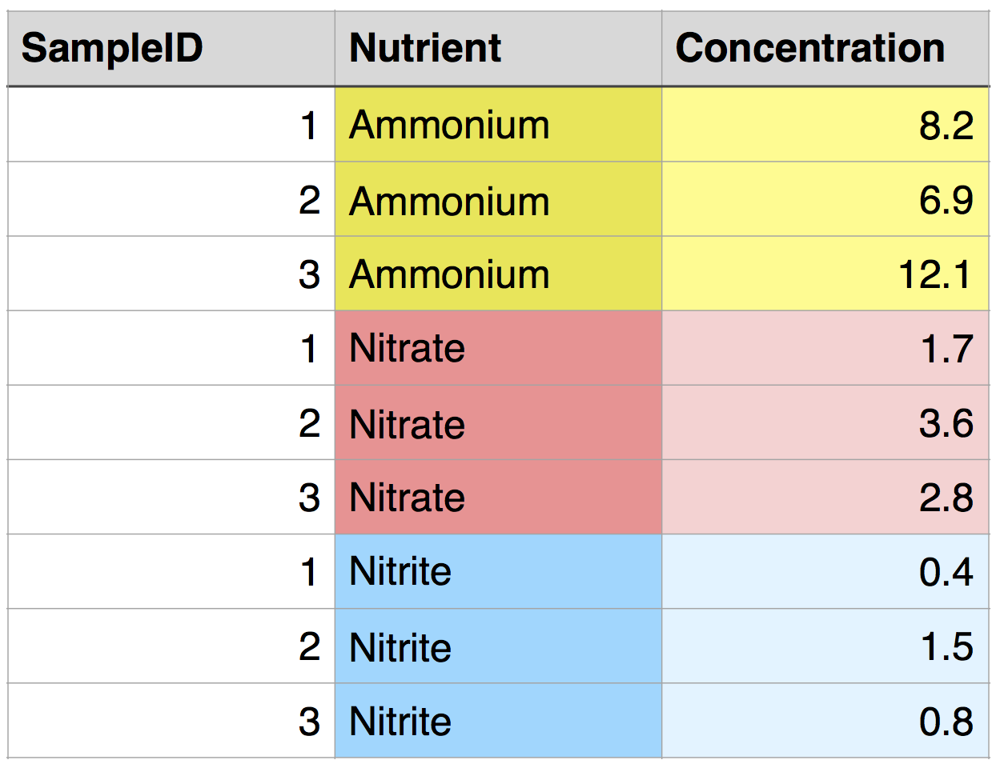
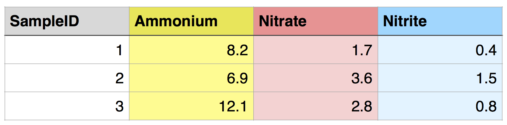
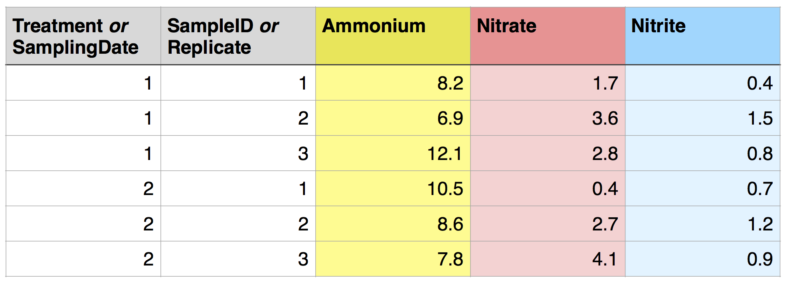
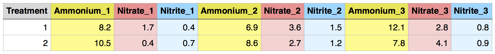

```{r opts, echo = FALSE}
# To output plots as .png figures, run this.

knitr::opts_chunk$set(
  fig.path = "Images/dplyrReshape/"
)
```


```{r, eval = TRUE, echo=FALSE, message=FALSE}
library("dplyr")   ## This would theoretically already be loaded from a previous lesson, but it needs to be loaded here if not.
```

___

* [What, and why?](#motivation)   
* [Data formats and tidy data](#tidydata) 
* [Converting between long and wide formats](#proselytize)
	+ [One more trick: `separate`](#separate)
		- *[Challenge](#challengeDataFormat)*
* [Resources](#resources)

___


# Why, and what? {#motivation}

Sometimes you may have several different data frames with data on the same set of samples, and you'd like to put them together into one data frame. If these separate data frames are set up differently from each other, you may need to restructure one or both to more easily align them. Or, your data may be in one data frame, but not in a form that works with the analysis functions that you want to use (e.g., for statistics).    

In the next two lessons, we will introduce you to reshaping functions from the package `tidyr` and join functions from the package `dplyr`, which you've already had some experience with. These functions will help you organize your data for analysis both in terms of making your data "tidy" as well as putting all observations or variables into the same data frame.   

Let's start by installing the package `tidyr`.  


```{r, eval = FALSE}
install.packages("tidyr")   ## install the package
```

```{r, eval = TRUE, warning=FALSE}
library("tidyr")   ## load the package
```


# Data formats and tidy data {#tidydata}

Data frames can be in either long format or wide format.   

To demonstrate, let's read in a data frame in long format: `nutrients_long`. There are three different measurements for each sample: ammonium, nitrate, and nitrite. All of the values are in a single column, `Concentration`, and the measurement is specified by a value in a second column, `Nutrient`. In `tidyr` and other similar packages, this variable (`Nutrient`) is called the *key*.  

<!--
## Originally written out, but it seemed unnecessarily time consuming, so now it's read in.
## This is here to re-create it if I'd like to.
nutrients_long <- data.frame(SampleID = rep(c(1, 2, 3), 3)
                        ,Nutrient = c(rep("Ammonium",3), rep("Nitrate",3), rep("Nitrite",3)) 
                        ,Concentration = c(8.2, 6.9, 12.1, 1.7, 3.6, 2.8, 0.4, 1.5, 0.8)
                        )
write.csv(nutrients_long,"Data/nutrients_long.csv", row.names=FALSE)
-->

```{r, eval=FALSE}
nutrients_long <- read.csv("Data/nutrients_long.csv")
nutrients_long
```

```{r, echo=FALSE}
nutrients_long <- read.csv("../Data/nutrients_long.csv")
nutrients_long
```

Here is the same data frame, using color to help you visualize the structure:

```{r, echo=FALSE, fig.align='center', out.width='360pt'}

```

But what if we want all of the data from one sample to be in a single row, with each nutrient in a separate column?  This would be called wide format, and it would look like this:   

```{r, echo=FALSE, fig.align='center', out.width='480pt'}

```

This is an example of "tidy" data ([Wickham 2014](https://www.jstatsoft.org/article/view/v059i10)).  It has the following characteristics:

1. Each variable forms a column.
2. Each observation forms a row.

Formatting your data in this way can streamline downstream analyses. A consistent data format makes it easier to pass data to functions and analyses.  

Of course, there are other structures and formats that may be more convenient for other purposes, but this one tends to be the most effective for analysis in R.   

The data you work with is likely more complex than in this example, and it can take some thought to decide what constitutes a variable.   

If the structure of your experiment involves groups between which you want to compare aggregate data (mean, maximum, etc.), these groups should usually be specified by a variable (i.e., a column), with each sample in each group in a separate row. For example, say you have two treatments applied to each `SampleID`, and you want to compare nutrient concentrations between treatments. Ideally, you would include a `Treatment` variable in your data frame, and each `SampleID` would be associated with 2 rows, one for each `Treatment`. The structure would be the same if you had multiple sampling dates instead of multiple treatments. It would also be similar if you had two `Treatments` that each had 3 replicates, with the variable name `Replicate` replacing `SampleID`. 

```{r, echo=FALSE, fig.align='center', out.width='600pt'}

```

This is a tidy dataset!  

In contrast, the following "messy" dataset has separate columns for different replicates of each treatment. This will make things much more difficult later and should be avoided. However, if your data comes this way, e.g. as output from an analytical instrument, it is straightforward to use reshaping functions to put it into a tidier form!

```{r, echo=FALSE, fig.align='center', out.width='900pt'}

```

For more on tidy data, here is Hadley Wickham's informal version of his full tidy data paper: [https://cran.r-project.org/web/packages/tidyr/vignettes/tidy-data.html](https://cran.r-project.org/web/packages/tidyr/vignettes/tidy-data.html)  
  
  
# Converting between long and wide formats {#proselytize}

Depending on the initial format of the data that you are working with, it may be necessary to convert it between long and wide format (and possibly in both directions) to make it tidy.

A simple way to convert your data from long to wide format is to use the function `spread` in `tidyr`. Here, we'll start with the data frame `nutrients_long` and convert it to wide format. As a reminder, here is the `nutrients_long` data frame:    

```{r echo=FALSE}
nutrients_long
```

```{r}
nutrients_wide <- nutrients_long %>% 
  spread(key = Nutrient, value = Concentration)

nutrients_wide
```

In the function `spread`, the `key` argument is the name of the column that contains a list of the data descriptors (or measurement names) that we want to separate, and these descriptors will become column names in wide format. The `value` argument indicates the values that will populate the data frame.   

Tip: When you're figuring out how to restructure your data for a downstream analysis, it can be helpful to write out a quick sketch of how you want the data to be organized, in terms of the names of the variables and the observations. This may help you figure out what input to give to each argument in the reshaping function.   

We can convert wide format data back to long format using the function `gather`.   

```{r}
nutrients_wide %>%
  gather(key = "Nutrient", value = "Concentration", Ammonium, Nitrate, Nitrite)
```

In this case, the argument `key` gives the *name* of the column that will have the data descriptors in it (here, "Nutrient"), and the argument `value` has the *name* of the column with the values (here, "Concentration"). The remaining input tells the function which variables to gather. In this case, this is a list of columns. For each column, the column name will be used to populate the named key column, and the values will be used to populate the named value column. SampleID is not listed and is maintained as an identifier for each observation - i.e., it is not gathered.   

You can accomplish the same task by telling R that you want to gather all of the columns besides SampleID, as follows:

```{r, eval=FALSE}
nutrients_wide %>%
  gather(key = "Nutrient", value = "Concentration", -SampleID)
```

You can also specify these columns using column numbers. Try these yourself to demonstrate that they give the same output.

```{r, eval=FALSE}
nutrients_wide %>%
  gather(key = "Nutrient", value = "Concentration", 2:4)

nutrients_wide %>%
  gather(key = "Nutrient", value = "Concentration", 2, 3, 4)
```

What happens if you only select two of the three columns of data?  

## One more trick: `separate` {#separate}

Sometimes a variable may contain information that really makes up two variables.  For example, the following data frame has one column that indicates both the nutrient analyzed and the sample replicate.

```{r, eval=FALSE}
nutrients_dbl <- read.csv("Data/nutrients_dbl.csv")
nutrients_dbl
```

```{r, echo=FALSE}
nutrients_dbl <- read.csv("../Data/nutrients_dbl.csv")
nutrients_dbl
```

We can separate that one variable into two new variables using the function `separate`. We will use `col` to specify which column to separate, `sep` to specify what character to separate on (i.e., the one that currently joins the two variables), and `into` to specify the names of the new columns.

```{r}
nutrients_dbl %>% separate(col=Nutrient_Rep, sep="_", into=c("Nutrient", "Rep")) 
```

Voilà! One column has become two.  Now we are in a position to further tidy the data frame, as we will see below.

#### Challenge {#challengeDataFormat}

1. The `trees` data frame is in long format: every observation (count) is in its own row, and the tree species is specified by the variable `Species`. Convert this data frame to wide format, with counts for different species in different columns.

```{r, eval=FALSE, echo=FALSE}
spread(trees, key=Species, value=Count)
```

2. Similarly, convert the original `trees` data frame to wide format, but with data from different plot replicates (specified by `Plot`) in different columns.

```{r, eval=FALSE, echo=FALSE}
spread(trees, key=Plot, value=Count)
```

3. Sometimes it may take multiple steps to tidy a dataset!  Above, we used `separate` to start to put `nutrients_dbl` into a tidier form. Do this again, but now convert the new, `separate`d data frame into a tidy data frame in wide format, with concentrations of different nutrients in different columns.

```{r, eval=FALSE, echo=FALSE}
nutrients_dbl %>% 
  separate(col=Nutrient_Rep, into=c("Nutrient","Rep"), sep="_") %>%
  spread(key=Nutrient, value=Concentration)
# nutrients_tidy
```

4. Let's start one step back! Use `gather`, `spread`, and `separate` to tidy a "messy" data set ("Experiment_nutrients_messy.csv") into a tidy one, i.e., by converting it to `nutrients_dbl` and then tidying it as above. 

	```{r, eval=FALSE}
	nutrients_messy <- read.csv(file="Data/Experiment_nutrients_messy.csv")
	nutrients_messy
	```

	```{r, eval=TRUE, echo=FALSE}
	nutrients_messy <- read.csv(file="../Data/Experiment_nutrients_messy.csv")
	nutrients_messy
	```

```{r, eval=FALSE, echo=FALSE}
nutrients_tidy <- nutrients_messy %>% 
  gather(key = "Nutrient_Rep", value  = "Concentration", -Treatment) %>%
  separate(col=Nutrient_Rep, into=c("Nutrient","Rep"), sep="_") %>%
  spread(key=Nutrient, value=Concentration)
# nutrients_tidy
```

___

# Resources {#resources}

* [Hadley Wickham on tidy data](https://cran.r-project.org/web/packages/tidyr/vignettes/tidy-data.html)

<br>
<hr>
<br>