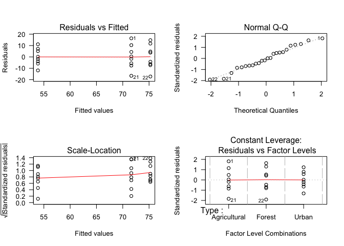

# ANOVA
CRI R Workshop  


___

* [What, and why?](#motivation)   
* [One-way ANOVA](#oneWayANOVA) 
	+ [Look at your data!](#lookAt)
	+ [Fit the model](#fitModel)
	+ [Post-hoc testing](#postHoc)
	+ [Check assumptions](#checkAssumptions)  
* [Two-way ANOVA](#twoWayANOVA)   
	+ [Look at your data!](#lookAt2)
	+ [Fit the model](#fitModel2)
	+ [Sidenote: Type I vs Type III Sums of Squares](#typeSS)
	+ [Post-hoc testing](#postHoc2)
	+ [Check assumptions](#checkAssumptions2)  
* [Resources](#resources)   

___

# What, and why? {#motivation}

Analysis of variance (ANOVA) is a statistical technique that lets us compare means of different groups of data to determine whether they differ significantly.   

At its most basic, a one-way ANOVA (i.e., with only one factor) with only two groups is the same as a t-test. ANOVA scales up this analysis, allowing for more than two groups within a factor, and for multiple factors.   

Under the hood, ANOVA is really a linear model where the explanatory variable is categorical rather than continuous. This is made clear by the process of running ANOVA in R. The basic approach is to use the function `aov`, which fits an ANOVA model by a call to `lm`. Alternatively, you can use `lm` directly. The output varies somewhat when the model is passed to the `summary` or `print` functions, but the statistical analysis is the same.

# One-way ANOVA {#oneWayANOVA}

We'll start with a one-way ANOVA, using the Inverts data from the previous few lessons. We have data from multiple catchment types (`Type`): agricultural, forest, and urban.  Our question is whether invertebrate species richness varies with catchment type.   

To run an ANOVA, we need our explanatory variable to be a factor. If you don't have `Inverts` in your environment, read it in, and make sure that `stringsAsFactors` is set to `TRUE`. If you already have it in your environment, but `Type` and `Country` are characters, you can use `mutate` and `as.factor` to convert them to factors.


```r
# Read in Inverts data (first introduced in functions lesson)
Inverts <- read.csv(file="../Data/Inverts.csv", stringsAsFactors=TRUE, header=TRUE)
```

## Look at your data! {#lookAt}

Once again, we will start by looking at our data!  Let's see if there is any evidence for richness varying with catchment type. We can do this with the `plot` function, which acts similarly to `boxplot` when we are plotting continuous data against factors. 


```r
plot(Richness ~ Type, data=Inverts)
```


It looks like invertebrate species richness is fairly comparable between streams in agricultural and forested areas, but lower in urban areas. However, there is enough variation that we don't know if this will be a statistically significant difference. So let's run an ANOVA and find out.   

## Fit the model {#fitModel}

To fit an ANOVA to the data, we can use either `lm` or `aov`, which will effectively do the same thing. The main difference is how the output is presented in a call to `summary`. For now, let's use `aov`, which will put the output of `summary` in a form that makes sense for ANOVA.

The help file for `aov` (`?aov`) notes that the default contrasts in R are not orthogonal, and `aov` will work better with orthogonal contrasts, so let's start by setting them. Contrasts have to do with how the levels of each factor are compared to each other in a linear model. Information on the various contrasts available in R can be found in the [help file](https://stat.ethz.ch/R-manual/R-devel/library/stats/html/contrast.html) for specific contrasts (e.g., `?contr.helmert`), and more detail on how each contrast setting works can be found in this [post on unordered contrats](http://www.clayford.net/statistics/tag/helmert-contrasts/) and a UCLA Stat Consulting Group [page](http://www.ats.ucla.edu/stat/r/library/contrast_coding.htm).

The following code both sets the contrasts to be orthogonal (`contr.helmert` for unordered factors and `contr.poly` for ordered factors) and assigns the original options to `op` so that they can be re-set using `options(op)`. (You can also set the contrasts within the call to `lm` or `aov` later on, using the argument `contrasts`, but we will do it earlier for convenience - it will now apply to all downstream models.)


```r
# Set default values to op to be able to re-set later; set current values to contr.helmert for unordered factors and contr.poly for ordered factors.
op <- options(contrasts = c(unordered="contr.helmert", ordered="contr.poly")) 

# Check contrasts in current settings, if you'd like
options()$contrasts
```

```
##       unordered         ordered 
## "contr.helmert"    "contr.poly"
```

Now we can fit the model. We'll store it as a named object so that we can work with it more easily later.   

You can name this object however you want, but it's good to be consistent with your naming scheme throughout your code, so that you can easily identify what kind of object you are working with. There are multiple naming conventions used in R and R packages, as well as multiple style guides (e.g., see [here](https://journal.r-project.org/archive/2012-2/RJournal_2012-2_Baaaath.pdf)). In the case below, the `.` in the model name is only for convenient reading, and there is some debate on when and how this `.` should be used.  


```r
InvertsType.mod <- aov(Richness ~ Type, data=Inverts)
```

Now let's take a look at the model object with `summary`. 


```r
summary(InvertsType.mod)
```

```
##             Df Sum Sq Mean Sq F value   Pr(>F)    
## Type         2   2094  1046.8   11.23 0.000483 ***
## Residuals   21   1958    93.3                     
## ---
## Signif. codes:  0 '***' 0.001 '**' 0.01 '*' 0.05 '.' 0.1 ' ' 1
```

This output gives us the results of an F-test with the null hypothesis that the groups are from the same statistical population, which would mean that their means do not vary. We can see that *p*<0.001, indicating that the groups are likely from different populations. Thus, species richness significantly varies with catchment type.

NOTE: The ANOVA table given by `summary` with an `aov` model gives results using Type I SS (Sum of Squares). The same is true for the function `anova`, which gives the same output as `summary`.  This does not matter for a one-way ANOVA, but it absolutely does with multiple factors! We will cover this further in the Two-way ANOVA section. For now, the point to remember is that you should not accidentally report your results from `summary` on an ANOVA model unless you are doing a one-way ANOVA, or if your experimental question is such that Type I SS makes sense (which is not common).

## Post-hoc testing {#postHoc}

In the case of our one-way ANOVA, however, this test is appropriate.  We've interpreted the results to mean that species richness varies with catchment type. But, which catchment types differ from each other? To assess this, we can use a Tukey test with the function `TukeyHSD` (for Tukey's "Honestly Significant Difference"" method).


```r
TukeyHSD(InvertsType.mod)
```

```
##   Tukey multiple comparisons of means
##     95% family-wise confidence level
## 
## Fit: aov(formula = Richness ~ Type, data = Inverts)
## 
## $Type
##                        diff        lwr       upr     p adj
## Forest-Agricultural   3.625  -8.545074 15.795074 0.7364753
## Urban-Agricultural  -17.750 -29.920074 -5.579926 0.0038490
## Urban-Forest        -21.375 -33.545074 -9.204926 0.0006580
```

The top part of the output tells us that we're using 95% confidence intervals. If for some reason we wanted to change this, we could use the argument `conf.level`, which defaults to 0.95.

The table below `$Type` gives us the *p*-values for comparisons between groups. From this, we can see that with a *p*-value of 0.05, species richness in forested and agricultural areas are comparable, whereas that of urban areas differs significantly from the two other groups.


## Check model assumptions {#checkAssumptions}

Of course, we can't use this model unless we know that we have satisfied the model's assumptions!  As with linear regression, we need to check the homogeneity and normality of the residuals. We will make the plots as before, starting with a histogram and a QQ plot of the residuals, and then comparing the residuals to the explanatory variable, `Type`.


```r
par(mfrow=c(2,2))  # Set plot layout
hist(resid(InvertsType.mod), las=1)  # Look at distribution of residuals
qqnorm(resid(InvertsType.mod), las=1)  # Compare distribution of residuals to a normal distribution
qqline(resid(InvertsType.mod))
plot(fitted(InvertsType.mod), resid(InvertsType.mod), las=1)  # Do the residuals vary by fitted values?
plot(Inverts$Type, resid(InvertsType.mod), las=1)  # Do the residuals vary by group?
```


```r
par(mfrow=c(1,1))  # Re-set plot layout
```

These plots give us good news.  The distribution of residuals doesn't look extraordinarily normal in the histogram, but this could be an effect of small sample size, and the QQ plot suggests a mostly normal distribution with a few potentially outlying points.  The bottom plots suggests that the residuals are comparable among groups (homogeneity).  On the plot of the residuals versus the fitted values, the values on the x-axis might seem obscure at first - these are the means for the three groups (Agricultural, Forest, and Urban).

We can also make similar plots by making a function call to `plot` using the model as input. In this case, the function will automatically point out potential outliers.


```r
par(mfrow=c(2,2))  # Set plot layout for 4 plots
plot(InvertsType.mod, las=1)  # Plot residuals for our ANOVA
```



```r
par(mfrow=c(1,1))  # Re-set plot layout
```

Now we can see that there are three points that are potential outliers. It could be useful to examine them further to determine whether there is any reason not to include them in the analysis.


# Two-way ANOVA {#twoWayANOVA}

We also have data on the country for each stream sample, and we might want to know whether invertebrate species richness varies between the US and Canada as well as catchment type. In addition, we might want to know whether the relationship between species richness and catchment type varies based on country. (This could be a biogeographical effect - or maybe invertebrates have sociopolitical preferences?!) To look at both of these factors, `Type` and `Country`, we can use a two-way ANOVA.

## Look at your data (again)! {#lookAt2}

We will of course start by looking at the data. We can look at species richness by country, to complement the above plot of species richness by catchment type, or we can look at species richness by all country-type groups, using `boxplot`.


```r
p <- par(mar=c(10,4,2,2))  # Save current parameters and re-set margins to allow for long x-axis labels
boxplot(Richness ~ Type + Country, data=Inverts, las=2)
```


```r
par(p)  # Reset margins
```

We can still see the differences between catchment type, but it's difficult to tell whether there are differences by country, especially between urban catchments. So, let's add `Country` to our model to see if it has an effect.

## Fit the model {#fitModel2}

Implementing a two-way ANOVA is similar to implementing ANOVA, in that we will use the model function (`aov`). It is also similar to multiple regression, in terms of the way that we specify multiple factors or explanatory variables. Here, we will use * to include both main effects and their interaction.


```r
Inverts2way.mod <- aov(Richness ~ Type * Country, data=Inverts)
summary(Inverts2way.mod)  # F-test with Type I Sum of Squares (probably not appropriate!)
```

```
##              Df Sum Sq Mean Sq F value  Pr(>F)    
## Type          2 2093.6  1046.8  10.904 0.00079 ***
## Country       1    4.2     4.2   0.043 0.83731    
## Type:Country  2  226.1   113.0   1.178 0.33068    
## Residuals    18 1728.0    96.0                    
## ---
## Signif. codes:  0 '***' 0.001 '**' 0.01 '*' 0.05 '.' 0.1 ' ' 1
```

Here is where it is important to remember that `summary` gives you results using Type I Sum of Squares! So, do not stop here to determine the significance of the independent variables.

#### Sidenote: Type I vs Type III Sums of Squares {#typeSS} 

Differences between different Types of Sums of Squares have to do with how the significance of each factor (independent variable or interaction) is considered relative to the others in the model. The importance of a given factor to predicting the dependent variable can be assessed by comparing the sum of squares when of the model including this factor to the sum of squares of the model without it. 

With Type I SS, the first factor on the right side of the formula is added to the model first, and the sum of squares is calculated. Then the next variable (or interaction) is added, and the change in sum of squares is calculated.  And so on, and so forth. For a two-way ANOVA with factors A and B and the interaction A:B, this means the main effect of factor A is calculated first, then the main effect of factor B given the main effect of factor A, and last the interaction of A and B after the main effects. This is why type I SS is also called "sequential sum of squares." This means that the results depend on the order in which the main effects are given in the model. 

With Type III SS, the significance of each variable is assessed by comparing a model with all effects and interactions *except* the variable of interest to the same model *with* the variable of interest. So the question is, given everything else in the model, do we increase explanatory power by including this variable? This process is repeated for each variable and interaction separately.

Your choice of model depends on your experimental question. When you're interested in the effects of both factors in ecology, you're generally interested in the effect of a factor after controlling for the others, in which case type III is what you should choose.

For more information, [this blog post](https://mcfromnz.wordpress.com/2011/03/02/anova-type-iiiiii-ss-explained/) has a nicely formatted version of [Falk Scholer's explanation](http://goanna.cs.rmit.edu.au/~fscholer/anova.php), and the top response to [this CrossValidated post on StackExchange](http://stats.stackexchange.com/questions/20452/how-to-interpret-type-i-type-ii-and-type-iii-anova-and-manova) had a nice explanation of how sums of squares are partitioned between effects in the different tests.

#### ...back to our model

If we want the results of an F-test using type III SS, we have several options - a good reminder that there are often multiple ways of doing the same thing in R! One option is to use the `drop1` function with an F test, which compares refitted models with different terms dropped. Another option is to use the `Anova` function in the package `car`, and specify `Type = III`. Both approaches will give you the same results for linear models, with only slightly different output due to their methods: `drop1` will give you AIC scores for the different models compared, and `Anova` will show you the significance of the intercept. If you don't need either of these, choose the function you like better - e.g., based on which syntax feels more intuitive to you, or whether you have installed the `car` package (but, you can run `install.packages("car")` if not)^1^. We will show that both give the same statistics.


```r
drop1(Inverts2way.mod, scope = ~., test="F")  # The scope argument designates the terms to be dropped; the . means all of them.
```

```
## Single term deletions
## 
## Model:
## Richness ~ Type * Country
##              Df Sum of Sq    RSS    AIC F value    Pr(>F)    
## <none>                    1728.0 114.64                      
## Type          2   2093.58 3821.6 129.69 10.9041 0.0007901 ***
## Country       1      4.17 1732.2 112.70  0.0434 0.8373079    
## Type:Country  2    226.08 1954.1 113.59  1.1775 0.3306785    
## ---
## Signif. codes:  0 '***' 0.001 '**' 0.01 '*' 0.05 '.' 0.1 ' ' 1
```

```r
library("car")
Anova(Inverts2way.mod, type="III")  # Specify Type III SS
```

```
## Anova Table (Type III tests)
## 
## Response: Richness
##              Sum Sq Df   F value    Pr(>F)    
## (Intercept)  107468  1 1119.4601 < 2.2e-16 ***
## Type           2094  2   10.9041 0.0007901 ***
## Country           4  1    0.0434 0.8373079    
## Type:Country    226  2    1.1775 0.3306785    
## Residuals      1728 18                        
## ---
## Signif. codes:  0 '***' 0.001 '**' 0.01 '*' 0.05 '.' 0.1 ' ' 1
```

With either function, we get the *p*-value for the F test with the null hypothesis that the different groups are from the same statistical population and thus have the same means. Here, *p*<0.05 for catchment `Type`! So this indicates that there are significant differences in species richness in streams from different catchment types.   

As a sidenote, here is where we could consider dropping the interaction term, since it is not significant. However, we will move on for now.   

## Post-hoc testing {#postHoc2}

We may still wonder about the differences between levels of the significant factor, `Type`. With a 2-way ANOVA, we can apply a Tukey test using the function `lsmeans` in the package `lsmeans`, along with the function `cld`, which controls the output that is displayed. The first argument to `cld` is an object created by `lsmeans`. `lsmeans` requires us to specify the model as well as the variable to test (e.g., `Type`), and give us confidence intervals as output, which we could use to determine which groups differ. We can also use `cld` to figure this out for us. For `cld`, we can to specify the *p*-value as `alpha`, the post-hoc test to use as `adjust`, and whether to use letters instead of the default to numbers for comparing groups.


```r
library("lsmeans")
```

```
## Loading required package: estimability
```

```r
cld(lsmeans(Inverts2way.mod, specs="Type"), alpha=0.05, adjust="tukey", Letters=letters) # Which Types vary from the others, using a Tukey tets?
```

```
## NOTE: Results may be misleading due to involvement in interactions
```

```
##  Type         lsmean       SE df lower.CL upper.CL .group
##  Urban        53.875 3.464102 18 44.76064 62.98936  a    
##  Agricultural 71.625 3.464102 18 62.51064 80.73936   b   
##  Forest       75.250 3.464102 18 66.13564 84.36436   b   
## 
## Results are averaged over the levels of: Country 
## Confidence level used: 0.95 
## Conf-level adjustment: sidak method for 3 estimates 
## P value adjustment: tukey method for comparing a family of 3 estimates 
## significance level used: alpha = 0.05
```

Take a look at the output under `.group`. Here we can see that the `Urban` streams have significantly different invertebrate species richness than the other catchment types. And, this approach gives us the added convenience of letters that can be used to denote significance on a figure!

If the interaction were significant and we wanted to do pairwise comparisons between groups, we could use the `lsmeans` function with  `specs = pairwise ~ Type * Country`. You can try this out if you're curious about the output.

So it looks like we can conclude that (in the world represented by this fake data) species richness varies among catchment types, with lower richness in urban areas - but we can only conclude this if the model assumptions are met!

## Check assumptions {#checkAssumptions2}

We will look at the model residuals as before.


```r
par(mfrow=c(2,2))  # Set plot layout
plot(Inverts2way.mod, las=1)
```


```r
par(mfrow=c(1,1))  # Re-set plot layout
```

And as before, our residuals look fairly normal and homogeneous, so we can report the model output.   


___

# Resources {#resources}

* [Quick-R on ANOVA](http://www.statmethods.net/stats/anova.html)

___
^1^*This is the "wine bottle label" method of function choice!*
