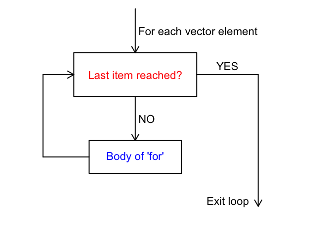

# Control structures - `if...else` and `for` loops
CRI R Workshop  


```
## Warning: package 'tidyr' was built under R version 3.2.5
```
___

* [What, and why?](#motivation)   
* [`if` and `if...else`](#ififelse) 
	+ [`if`](#if)
	+ [`if...else`](#ifelse)
	+ *[Challenge](#challengeifelse)* 
* [`for` loops](#forloops)
	+ [But why would I want to use a for loop, you ask?](#butwhy)
	+ *[Challenge](#challengeforloop)*

___

# Why, and what? {#motivation}

Control structures allow us to alter the flow of a program, and to make decisions about when or how many times an action occurs. Here we will introduce you to two of them: if...else statements and for loops.   

# `if` and `if...else` {#ififelse}

## `if` {#if}

*if* statements test whether a condition is true, and then execute a piece of code if so. This can be diagrammed as follows:   


In R, an `if` statement looks like the following:


```r
if (test condition is true) { 
  run this line of code
  }
```

Note that the conditional test is in parentheses, and the action to be executed is in curly braces `{ }`.  It is not necessary to put the body of the if statement on a separate line, but this helps your code to be more readable.  The same is true for the indentation - it is there to help you read your code more easily.      

As an example, we can write an if statement to act based on whether a number is positive.   


```r
a <- 4  # Set value for a
if (a > 0) {
  print("positive")
}
```

```
## [1] "positive"
```

But what if the number is negative?  Try this out for yourself.   

With `a` set to a negative value, nothing was printed.  Let's change the statement so that "negative" is printed if the condition is not true. Here's where the `else` part comes in.  

## `if...else` {#ifelse}

An **if...else** statement controls flow in this way:   


To accomplish this, the code will look like this:   


```r
if (test condition is true) { 
  run this line of code
  } else {
    run this other line of code instead
  }
```

Note that the `else` has to be on the same line as the closing bracket of the `if` statement.   

Building onto the earlier example, we can add the `else` part to have the function print "negative" if the value is not above 0. We'll set the value of `a` to a negative number to demonstrate the flow:   


```r
a <- -3
if (a > 0) {
  print("positive")
} else {
  print("negative")
}
```

```
## [1] "negative"
```

Great, our statement works! But what if the value of `a` is 0? Try this out for yourself.   

In this case, our assessment is incorrect. We can add a second test condition to the statement using `else if`, which effectively nests one if...else inside the other.

The R code will be structured like this:   


```r
if (test condition is true) { 
  run this line of code
  } else if {
    run this other line of code instead
  } else {
    run this line of code when none of the previous conditions are true
  }
```

As an example, with `a` now equal to 0, and specifying all expected conditions (with the last `else` as a silly warning):   


```r
a <- 0
if (a > 0) {
  print("positive")
} else if (a < 0) {
  print("negative")
} else if (a == 0) {
  print("zero")
} else {
  print("Houston, we have a problem.")
}
```

```
## [1] "zero"
```

Try changing the value of `a` and re-running the `if...else` statement to see for yourself how it works.   

Is it possible to get to the last `else` statement? How, or why not?   

There is another way to write an if...else statement, and that is with the `ifelse` function. This function has 3 arguments: the `test` case; `yes`, or what to do if the test case is true; and `no`, or what to do if the test case is false. Let's use this function to test whether a number is even. We can do that using `%%`, which gives the remainder after division.   


```r
a <- 43
a %% 2
```

```
## [1] 1
```

```r
ifelse(test = a %% 2 == 0, yes = "even", no = "odd")
```

```
## [1] "odd"
```

Here, if the remainder after division by two is equal to 0, the test case is true, and "even" is printed. Otherwise, if the test case is false, "odd" is printed. With `a` equal to 43, the remainder was 1, and therefore "odd" was printed. Try a few values of `a` for yourself to see how this works.

Let's work with the `nutrients` data to demonstrate when this could be helpful. As a reminder, here is the data frame:


```r
nutrients
```

```
##   Treatment Replicate Ammonium Nitrate Nitrite
## 1         1         1      8.2     1.7     0.4
## 2         1         2      6.9     3.6     1.5
## 3         1         3     12.1     2.8     0.8
## 4         2         1     10.5     0.4     0.7
## 5         2         2      8.6     2.7     1.2
## 6         2         3      7.8     4.1     0.9
```

The instruments and methods that are used to measure nutrient concentrations often have detection limits, and values below this limit cannot be distinguished from 0. For this reason, one might choose to set these values equal to 0 or to `NA`. Let's say the detection limit for nitrite is 0.5 ppm. Rather than manually checking which values are less than or equal to 0.5, and then changing those values using subsetting, we can use an `ifelse` statement within `mutate` to do this for us. We'll add the "corrected" data as a new variable.   


```r
nutrients <- nutrients %>%
  mutate(Nitrite_corr=ifelse(Nitrite<=0.5, NA, Nitrite))

nutrients
```

```
##   Treatment Replicate Ammonium Nitrate Nitrite Nitrite_corr
## 1         1         1      8.2     1.7     0.4           NA
## 2         1         2      6.9     3.6     1.5          1.5
## 3         1         3     12.1     2.8     0.8          0.8
## 4         2         1     10.5     0.4     0.7          0.7
## 5         2         2      8.6     2.7     1.2          1.2
## 6         2         3      7.8     4.1     0.9          0.9
```

#### Challenge {#challengeifelse}

* Write an if statement that takes a person's age (numeric element) as input and returns a statement about whether or not the person is old enough to vote.


* Write an if statement that takes a name (character element) as input and returns a statement about whether or not the name is the same as yours.


* Add a variable, `Abundance`, to the `trees` data frame that is equal to `"High"` if the species was counted at least 10 times, and `"Low"` otherwise.


* Add a variable, `Period`, to the `Fundybirds` data frame that indicates whether each bird was counted in the morning or the afternoon. 


#### Bonus challenge

* Write an if statement that returns a message if any values of `Nitrate` in `nutrients` are less than 2.   

...did you get the error message below?


```r
if (nutrients$Nitrate < 2) { print("Less than two!") }
```

```
## Warning in if (nutrients$Nitrate < 2) {: the condition has length > 1 and
## only the first element will be used
```

```
## [1] "Less than two!"
```

What happened here?   

The if statement can only accept a single element, so if you try to use a vector with multiple elements, it will only act on the first one. We can use the function `any` to assess whether any elements of a vector are `TRUE` and return only a single `TRUE` or `FALSE` value. Similarly, we can use the function `all` to assess whether all elements of the vector are `TRUE`.   

For example: 


```r
any(nutrients$Nitrate < 2)
```

```
## [1] TRUE
```

#### Bonus challenge redux

* Try the above challenge again, using the `any` function.   

**Solution:**   


```r
if (any(nutrients$Nitrate < 2)) {
  print("At least one value is less than 2.")
}
```

```
## [1] "At least one value is less than 2."
```


# `for` loops {#forloops}

Another useful control structure that we can use in R is a **for loop**. For loops iterate over values in a vector, and execute code for each value. This can be extremely helpful if you want to perform an action multiple times! For example, you might want to read in multiple files, or do the same thing to multiple data tables. The flow of a for loop looks like this:   





The code in R has this general structure:   


```r
for (n in c(your vector)) {
  do this thing involving n
}
```

In this loop, `n` will be set iteratively to each of the values in your vector, and the code in brackets will be executed for each value of `n`. To demonstrate how this works, let's print every number in a vector.


```r
for (n in c(1:5)) {
  print(n)
}
```

```
## [1] 1
## [1] 2
## [1] 3
## [1] 4
## [1] 5
```

It's not important what variable we put in the place of `n`. We can name this variable `x`, or `trees`, or `fabulousvariable`, or `Constantinople`.


```r
for (Constantinople in c(1:5)) {
  print(Constantinople)
}
```

```
## [1] 1
## [1] 2
## [1] 3
## [1] 4
## [1] 5
```

We can even create a vector of character strings, and have the for loop step through each element of this character vector.


```r
for (colors in c("red", "blue", "green", "yellow", "orange", "white")) {
	print(colors)
}
```

```
## [1] "red"
## [1] "blue"
## [1] "green"
## [1] "yellow"
## [1] "orange"
## [1] "white"
```

And, we can do whatever we want with the variable inside the for loop.  For example, we can multiply the value of a numeric variable by 2, or we could put a character variable into a sentence.


```r
# Multiply each element of a numeric vector by 2, and print this new value
for (Constantinople in c(1:5)){
	print(Constantinople * 2)
}
```

```
## [1] 2
## [1] 4
## [1] 6
## [1] 8
## [1] 10
```

```r
# Print a sentence with each element of a character vector
# (Use paste to put the character strings into one)
for (colors in c("red", "blue", "green", "yellow", "orange", "white")) {
	print(paste("I am sure that",colors,"is the best color of all!"))
}
```

```
## [1] "I am sure that red is the best color of all!"
## [1] "I am sure that blue is the best color of all!"
## [1] "I am sure that green is the best color of all!"
## [1] "I am sure that yellow is the best color of all!"
## [1] "I am sure that orange is the best color of all!"
## [1] "I am sure that white is the best color of all!"
```

## But why would I want to use a for loop, you ask? {#butwhy}

For loops can be useful for applying the same action to multiple objects. For example, let's say that you have many data frames with the variable "Species_Names", and you want to rename that column to simply be "Species."  Let's read in files like this, with bird count data from several different months.


```r
# Read in bird count data
	birds_jan <- read.csv(file="~/Documents/R/CREATE_R_Workshop/Data/birds_jan.csv")	
	birds_feb <- read.csv(file="~/Documents/R/CREATE_R_Workshop/Data/birds_feb.csv")	
	birds_mar <- read.csv(file="~/Documents/R/CREATE_R_Workshop/Data/birds_mar.csv")	
	birds_apr <- read.csv(file="~/Documents/R/CREATE_R_Workshop/Data/birds_apr.csv")	

head(birds_jan)
```

```
##           SpeciesNames Count
## 1 Haemorhous purpureus    58
## 2     Sturnus vulgaris    48
## 3     Accipitridae sp.    39
## 4   Dryocopus pileatus    54
## 5     Mergus merganser    46
## 6  Phasianus colchicus    37
```

You can rename a variable in a data frame using the function `rename` in `dplyr`. Note that within the function, the syntax is `NewName = OldName`.


```r
# Rename variable from "SpeciesNames" to "Species"
birds_jan <- rename(birds_jan, Species = SpeciesNames)

head(birds_jan)
```

```
##                Species Count
## 1 Haemorhous purpureus    58
## 2     Sturnus vulgaris    48
## 3     Accipitridae sp.    39
## 4   Dryocopus pileatus    54
## 5     Mergus merganser    46
## 6  Phasianus colchicus    37
```

```r
# Reset original name
birds_jan <- rename(birds_jan, SpeciesNames = Species)
```

Alternatively, we can do this with `assign` to be more concise.  `assign` is exactly like `<-`, except that the variable name and the value are specified inside the function.


```r
# Rename variable from "SpeciesNames" to "Species"
assign(x="birds_jan", value=rename(birds_jan, Species = SpeciesNames))  

head(birds_jan)
```

```
##                Species Count
## 1 Haemorhous purpureus    58
## 2     Sturnus vulgaris    48
## 3     Accipitridae sp.    39
## 4   Dryocopus pileatus    54
## 5     Mergus merganser    46
## 6  Phasianus colchicus    37
```

```r
# Reset original name
birds_jan <- rename(birds_jan, SpeciesNames = Species)
```

But what if we want to change the variable name in every single data frame?  With four data frames, it might not be terrible to write out a line for each one, but with more data frames, this could quickly become an unwieldy time sink.  

Enter *for loops*.  With for loops, we can approach the problem differently.  First, we will create a vector with the names of all the data frames.  Then, we will use a for loop to step through every element of that vector - i.e., each data frame name - and change the variable name for each one.


```r
# Create a vector with the names of all the data frames we want to work on
	dfnames <- c("birds_jan", "birds_feb", "birds_mar", "birds_apr")

# Step through the above vector and rename the SpeciesNames variable to Species
	for (dataframe in dfnames){
		assign(x = dataframe, value = rename(get(dataframe), Species = SpeciesNames))
	}
```

**Code trick sidenote**: In the above code, we needed to use the function `get` to specify the data frame in `rename`.  This is because what we have is a character vector that is the name of the data frame (e.g., `"birds_jan"`), but `rename` is looking for the data frame itself (e.g., `birds_jan`). `get` gets the value of the variable that you pass to it.  

To explore this, try typing `dfnames[1]`, and then try typing `get(dfnames[1])`.

The output of the first one is the first element of dfnames, which is the name of the data frame.  The second one, however, gives us the value of the data frame that has that name.  `get` searches for an object with the name specified by the `x` argument. This allows you to pass a vector or list of names of variables to other functions.

As another example, try running `x <- 5`, then try `"x"` versus `get("x")`.  

And now we can use another for loop to look at the results of our code!


```r
for (dataframe in dfnames){
	dataframe %>% print()                 # Print name of data frame to screen
	get(dataframe) %>% head() %>% print()	# Get data frame from its name, show head, print to screen
}

## Note that we could also have set this up with a numeric vector of 1:4, 
##   instead of the vector dfnames:
# 	for (n in 1:length(dfnames)){
# 		dfnames[n] %>% print()
# 		get(dfnames[n]) %>% heads() %>% print()
# 	}
```

```
## [1] "birds_jan"
##                Species Count
## 1 Haemorhous purpureus    58
## 2     Sturnus vulgaris    48
## 3     Accipitridae sp.    39
## 4   Dryocopus pileatus    54
## 5     Mergus merganser    46
## 6  Phasianus colchicus    37
## [1] "birds_feb"
##                  Species Count
## 1        Regulus satrapa    27
## 2 Zonotrichia albicollis    40
## 3   Eremophila alpestris     2
## 4     Larus delawarensis    18
## 5         Spinus tristis    12
## 6      Picoides villosus    47
## [1] "birds_mar"
##                                Species Count
## 1                       Cathartes aura    16
## 2                Plectrophenax nivalis     9
## 3 Junco hyemalis hyemalis/carolinensis    58
## 4                     Accipitridae sp.    12
## 5            Icterus bullockii/galbula    18
## 6                 Poecile atricapillus    52
## [1] "birds_apr"
##                        Species Count
## 1              Regulus satrapa    25
## 2           Poecile hudsonicus    49
## 3               Spinus tristis    37
## 4 Columba livia (Feral Pigeon)    13
## 5        Plectrophenax nivalis    27
## 6       Zonotrichia albicollis    18
```

### Another example: Reading in multiple files

A slightly more complicated, but potentially very useful, example could be if you want to read in multiple data files automatically and assign them to different data frames. To do this, we can start with a data frame specifying the names of the files and the data frame names that we want to give to them.

<!--This is not evaluated because these file names work from the working directory, but not the directory the Rmd file is in.-->

```r
ExperimentFiles <- data.frame(files = c("Data/Experiment_carbon.csv", "Data/Experiment_nutrients.csv")
                              ,names = c("carbon", "nutrients")
                              ,stringsAsFactors = FALSE)
ExperimentFiles
```

<!--This has the right file paths to be run within the r chunk. Yes, I will probably do it differently next time...-->

```
##                              files     names
## 1    ../Data/Experiment_carbon.csv    carbon
## 2 ../Data/Experiment_nutrients.csv nutrients
```

Now we can step through the observations in ExperimentFiles, read in each file, and assign it to a data frame with a specified name.   


```r
for (n in 1:2) {
  assign(x = ExperimentFiles$names[n], value = read.csv(file = ExperimentFiles$files[n]))
  get(x = ExperimentFiles$names[n])
}
```

There are several layers to this piece of code. The `assign` function assigns the value specified by `value` to a variable named `x`. When `n` is 1, the name of the variable will be first observation 1 in `ExperimentFiles$names`, and the value of the variable is the .csv file that we're reading in, specified by observation 1 in `ExperimentFiles$files`. When `n` is 2, the name and value of the variable will be the second observations in our data frame.   

The last line in the for loop uses the `get` function, as above. Try typing `ExperimentFiles$names[n]` without the `get` function.   

The output is the `n`th character in that variable, i.e. `"carbon"` or `"nutrients"`. What we want, though, is the value of the variable that has that name. To do that, we use the `get` function, which searches for an object with the name specified by the `x` argument. This allows you to pass a list of names of variables to other functions.   

#### Challenge {#challengeforloop}
* Write a for loop that steps through a numeric vector and prints a number that is 4 times the number of the changing variable.


* The code within the brackets `{ }` of a for loop does not necessarily have to refer to the values in the controlling vector! Write a for loop that loops through 10 times, and each time, adds 1 to a given variable and then prints the value of that variable.


* Write a for loop that goes through the rows of the `trees` data frame and prints the value of `Count` if the `Species` is `Acer rubrum`.


* Write a for loop that goes through the `nutrients` data frame and prints the value of each `Nitrite` observation plus 1. 
    + Next, create a vector called `nitrite_plus`, and modify your for loop to add the "Nitrite plus 1" values to the end of this vector.   

#### Bonus challenge

* Write a for loop that goes through the `nutrients` data and prints out whether or not dissolved inorganic nitrogen (the sum of nitrate, ammonium, and nitrite) is greater than 12. Use the `dplyr` function `slice`, which lets you select rows of a data frame by their order.

<br>
<hr>
<br>

