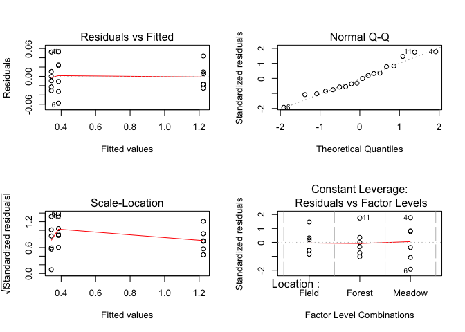

# Data Workflow Challenge Solutions
CRI R Workshop  


# Setup

* Create a project folder with an appropriate file structure, including subfolders for:
	+ Raw data 
	+ Clean data

# Script 1: Raw data to clean data

Then, write a script to read in all of the absorbance data and output sample concentrations to the clean data folder:


```r
##
## ReadAbsorbances.R
## LDBrin
## 2016 June 16
##
## This script was written for the multiple ecosystems N cycling experiment. 
## It processes absorbance data for the nitrification assay and outputs nitrate concentrations.
## It includes the following steps:
##  - Read absorbance data
##	- Plot calibration curve
##	- Determine calibration equation
##	- Calculate sample concentrations from absorbances
##	- Write sample concentrations to file
##
```

* Read in absorbance data (.csv file)


```r
library("dplyr")
library("tidyr")

# Read in Absorbance data
NitrifAbsorbance <- read.csv(file="../Data/Nitrification_Absorbances.csv", stringsAsFactors=TRUE, header=TRUE)
```

* Plot the calibration data
	+ Write (and run) a function to do this
	

```r
plotAbsorbanceData <- function(absorbances) {
	plot(StandardConc ~ Absorbance, data=absorbances, las=1, pch=19, xlim=c(0,0.6), ylim=c(0,6))
}

plotAbsorbanceData(NitrifAbsorbance)
```

<!-- -->
	
* Calibration curve
	+ Again, use a function to do this!
	+ Figure out how concentration (dependent variable) is dependent on absorbance (independent variable) for standards: run a linear regression
	+ Print the adjusted r^2^ value for the model fit
	+ Extract the coefficients of the equation relating concentration to absorbance
	

```r
findCalibEquation <- function(absorbances){
	# Pull out x and y values for the linear regression
		xvals <- filter(absorbances,Type=="Standard")$Absorbance
		yvals <- filter(absorbances,Type=="Standard")$StandardConc
	# Fit the linear regression model, and extract coefficients and adjusted r2
		calib.lm <- lm(yvals~xvals)
		intercept <- summary(calib.lm)$coefficients["(Intercept)", "Estimate"]
		slope <- summary(calib.lm)$coefficients["xvals", "Estimate"]
		adjr2 <- summary(calib.lm)$adj.r.squared
	# Print adjusted r2
		print(paste("The adjusted r2 is ",round(adjr2,3),".", sep=""))
	# Return slope and intercept for future calibration calculations
		return(data.frame(Slope=slope, Intercept=intercept))
}	

# Run the function
	CalibCoeffs <- findCalibEquation(NitrifAbsorbance)
```

```
## [1] "The adjusted r2 is 0.993."
```

```r
# Look at the output
	CalibCoeffs
```

```
##      Slope Intercept
## 1 8.615794 -0.613339
```

* Calculate sample concentrations
	+ Write a function that uses the linear regression coefficients to calculate concentration based on absorbance
	+ Apply this to only the samples, not the standards
	+ Output a data frame with sample ID and calculated concentration
	

```r
CalcConc <- function(slopeIntdf, absorbances){
	# Extract slope and intercept from data frame output of findCalibEquation 
		slope <- slopeIntdf$Slope
		intercept <- slopeIntdf$Intercept
	# Take input data frame, select samples only, calculate concentration from absorbance,
	# and create a data frame with only the sample ID and concentrations
		outputdf <- absorbances %>% 
			filter(Type == "Sample") %>%
			mutate(Concentration = Absorbance * slope + intercept) %>%
			select(SampleID, Concentration)
	# Return this data frame
		return(outputdf)
}

# Run the function
SampleConcentrations <- CalcConc(CalibCoeffs, NitrifAbsorbance)

# Look at the output
SampleConcentrations
```

```
##    SampleID Concentration
## 1        S1     0.4078092
## 2        S2     0.4092299
## 3        S3     0.3521365
## 4        S4     0.4376526
## 5        S5     0.3735864
## 6        S6     0.3267001
## 7        S7     0.3334894
## 8        S8     0.3534815
## 9        S9     0.3121429
## 10      S10     0.3203451
## 11      S11     0.3952077
## 12      S12     0.3426652
## 13      S13     1.2677800
## 14      S14     1.1985366
## 15      S15     1.2073290
## 16      S16     1.2068086
## 17      S17     1.2336512
## 18      S18     1.2295561
```
	
* Write data to file   
	+ Output a .csv file with this data to the clean data folder


```r
# Write data frame to csv file
	write.csv(SampleConcentrations, file="../Data_Output/SampleConcentrations.csv",row.names=FALSE)


# If you were working with multiple data files, and this were part of a function or for loop,
#   you would likely want to specify the filename with the paste function, and include an 
#   identifier as part of the name.  For example:
#				file = paste("Data_Output/SampleConcentrations", sampleset, ".csv", sep="")
#		where sampleset is a variable that varies depending on the sample input.
```

# Script 2: Clean data to plotting and analysis

Then, write another script that uses this clean data and looks for differences between treatments:


```r
##
## AnalyzeConcentrations.R
## LDBrin
## 2016 June 16
##
## This script was written for the multiple ecosystems N cycling experiment. 
## It reads in and analyzes concentrations from the potential nitrification assay.
## It includes the following steps:
##  - Read concentration data
##	- Join with sample inventory data
##	- Plot concentrations against treatment to assess differences
##	- Analyze differences among treatments with an ANOVA
##
```


* Read in the concentration data


```r
# Read in concentration data
	NitrateConcentrations <- read.csv(file="../Data_Output/SampleConcentrations.csv", stringsAsFactors=TRUE, header=TRUE)
```

* Read in sample inventory with treatment data


```r
# Read in sample inventory data
	SampleInventory <- read.csv(file="../Data/Sample_Inventory.csv", stringsAsFactors=TRUE, header=TRUE)
```

* Merge the clean data with the sample treatment information from the inventory


```r
# Add sample inventory data to nitrate concentrations (Location and Replicate)
	NitrateConcentrations <- NitrateConcentrations %>% left_join(SampleInventory, by="SampleID")
```

* Make a plot to look at differences in NO~3~^-^ concentrations among treatments


```r
# Plot Concentration by Location
	plot(Concentration ~ Location, data=NitrateConcentrations, las=1)
```

<!-- -->

* Run an ANOVA to assess differences in NO~3~^-^ concentrations among treatments


```r
# Fit and examine ANOVA
	Nitrate.mod <- aov(Concentration ~ Location, data=NitrateConcentrations)
	summary(Nitrate.mod)  # Location is significant!!
```

```
##             Df Sum Sq Mean Sq F value Pr(>F)    
## Location     2 2.9652  1.4826    1378 <2e-16 ***
## Residuals   15 0.0161  0.0011                   
## ---
## Signif. codes:  0 '***' 0.001 '**' 0.01 '*' 0.05 '.' 0.1 ' ' 1
```

```r
# Check model assumptions by examining residuals
	m <- par(mfrow=c(2,2))  # Set layout to be 2 x 2
	plot(Nitrate.mod)  # Residual plots
```

<!-- -->

```r
	par(m)  # Reset layout
```

<br>
<hr>
<br>
