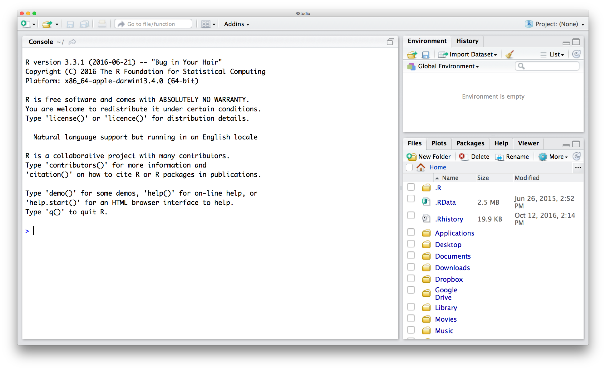

# Installation and Setup
___

# Download and install R and RStudio

Please download and install R and RStudio at the following links if you don’t already have one or both programs.  If you already have R and/or RStudio, please update to the latest versions.  If you have problems with the installation process, please contact the course instructor. 

## R

Install R from [https://cran.rstudio.com](https://cran.rstudio.com)

Click on one of the top 3 links, depending on your operating system. 

For a Mac, next click on one of the top 2 links, depending on the version of your operating system (OS X 10.9 and higher versus OS X 10.6 - 10.8), and then run the downloaded installer. 

For Windows, next click on “install R for the first time,” then “Download R 3.3.0 for Windows,” and then run the downloaded installer.

## RStudio

Install RStudio from [https://www.rstudio.com/products/rstudio/download/](https://www.rstudio.com/products/rstudio/download/)

Look at “Installers for Supported Platforms,” and download the appropriate version, likely one of the first two links (depending on whether you have a Mac or a PC). 

When you have downloaded and installed both R and RStudio, open RStudio to check that it has been installed correctly.  It should look something like this:

