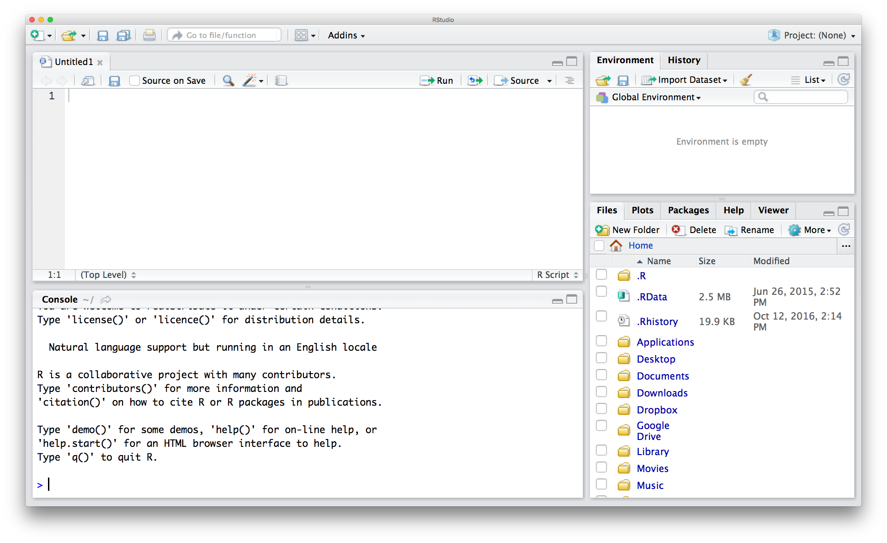
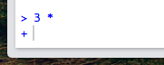
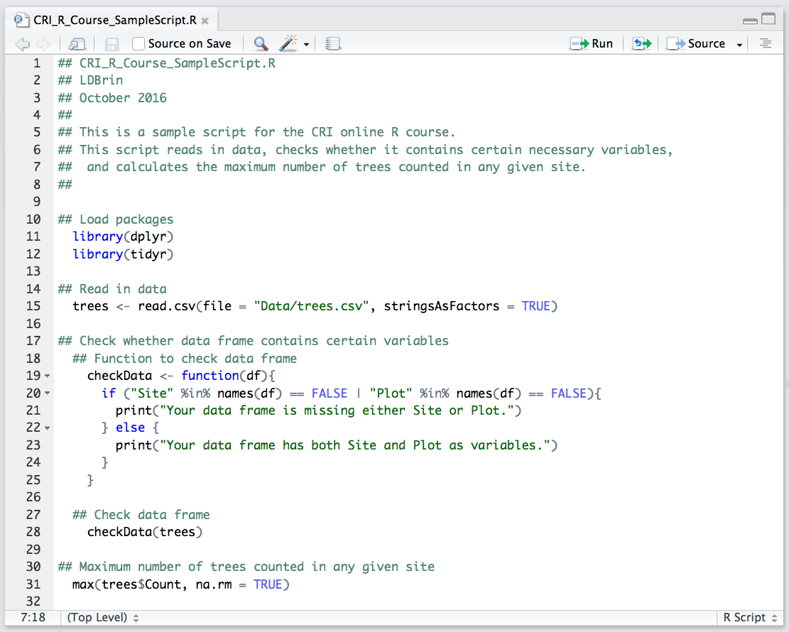

# Organization and R basics


___

# Why, and what?

In this lesson, we will cover some of the basics of working with R and starting a new project. This will help you get your footing and be prepared for future lessons.

___

# Why use R?

There are two aspects to the question of why to use R for data analysis:

1. Why should we use this approach, in terms of writing code to process data and data files?  
2. Why should we use R in particular?

## Why take this approach?

* Reproducibility

	One of the major reasons to use coding and scripts to work with data is that it allows for reproducible science. If all of your analyses are written out and documented, and you are not working with the original data files directly, you can always go back to your code and re-run an analysis.
	
* Two aspects of this reproducibility:
	- Easier to prevent or spot mistakes
		+ Because all analyses are written out in one place, it is simpler to review your work and look for mistakes.  Also, because you are not modifying the original data files directly, you are more likely to avoid a disastrous mistake where underlying data is changed or lost.
		
	- Simpler to change analyses
		+ If you decide to change your approach to an analysis, even down to a simple calculation, it is straightforward to apply your change to all of your data. This avoids things like having to check and re-check a myriad of spreadsheet cells with internal references.
		
## Why R in particular?

There are several different options for programs, or combinations of programs, that can serve a similar purpose to R.  One commonly used, free alternative is python, which shares many of the same advantages as R.  Differences in structure and available packages for the two programs mean that each may be somewhat better suited to different tasks (e.g., statistics, visualization, or programming) or scientific fields (e.g., whether a certain set of advanced functions or analyses are already available), but both are great options (see comparison [here](https://www.datacamp.com/community/tutorials/r-or-python-for-data-analysis#gs.CkwTK4M)).  There are also commercial alternatives for statistical analyses and programming, such as SAS or MATLAB.

So, what are the benefits of using R?

* Free
	- R is free, both in terms of cost and it being open source
* Well-documented
* Cross-platform
* Active community, especially scientists
	- Community members develop packages (collections of functions or analyses) that can greatly expand the program's functionality
	- There are many community resources for getting help
* At least as good as, if not better than, commercial alternatives
* Useful tool for many aspects of research (and both statistics and data science)

___

# RStudio interface

RStudio is an is an Integrated Development Environment (IDE) for R.  Essentially, it is a graphical interface that makes it easier to work with R, by pulling together different components of the typical analysis workflow.  When you open RStudio, it automatically opens an R session.  When you run commands in RStudio, it sends them to R and returns the result.  RStudio also allows you to do things like navigating the files on your computer, inspecting variables that you have created, and visualizing plots.

Open RStudio on your own computer. Your screen should look something like this:


If you have not already opened a script, open a new one, in one of two ways:

* Go to the menu bar at the top of the screen, and click `File` -> `New File` -> `R Script`.  
* Alternatively, click on the white rectangle with the green circle and white plus sign in the top left corner of the RStudio window, and then click on `R Script`.  Your screen should now look something like this:




There are 4 panes, or areas, of the program window. 

1. The bottom left pane is the **console**. 
	- This is where commands are executed, and you can see the resulting output.
	- The console has short term memory only!  Results of computations are not stored, and if you close RStudio, your commands will be gone.
	- This space is useful for testing pieces of code or for looking at the details or structure of different objects.
	
	<br>
	Try this out for yourself: Type the following, and then hit enter: `4 + 5`.  Then try a few different math problems.
	
	
6. The top left is the **R script** pane.  
	- If several script files are open, this pane can have multiple tabs, each with a different script.
	- Here, you can type in commands and then save them for later reference. You can also create executable scripts.
	- To execute (run) a section of code in the script pane, you have several options:
		+ Select the code, then click `Run` in the top right corner of the script pane. 
		
		
		
		+ Select the code, then press `ctrl`+`enter`. On a Mac, you can press `command`+`enter`.
		+ To run a whole line, put your cursor on the line and then run the selected line with either of the two previous approaches (click the `Run` button, or use a keyboard shortcut).
		
	<br>
	Try this out for yourself: Type a math problem in the console (e.g., `4 + 5`), then run the line in each of the ways described above.
	
	
6. The top right pane has the **`Environment`** and **`History`** tabs.
	- The `Environment` tab displays the names of variables in your R session, and information on the structure and/or values of each.
	- The `History` tab shows you all of the code that you have run, either in this session, or as stored to an R history file (.Rhistory).
	
	<br>
	Try this out for yourself: Define a variable, `x`, by typing and running the following (in the console or in your new script): `x <- 5`. Then look at your `Environment` and `History` panes.


6. The bottom right pane has **lots of options**! 
	- `Files`: This is how you navigate directories on your computer.
	- `Plots`: This is where plots will be displayed.
	- `Packages`: This shows you which of your installed packages are loaded.
	- `Help`: This is where you can find help files.
	- `Viewer`: This is like the plots pane, except that it is especially for displaying web content.
	
	<br>
	Try this out for yourself: Navigate through your file system in the `Files` tab. Then try searching for something in the search bar of the `Help` tab - try the word "small", and then the word "print".  Notice that when there is a specific entry for the word you searched, this entry will be displayed, but if not, you will see all the help pages that include this word.
	
___

# Project directory structures and the working directory

It is a good idea to keep all of your project files together in one directory, and to have a consistent subdirectory structure. Besides the fact that this helps with general organization, it also allows you to work with relative file paths within a project.  This means that you can specify a **working directory** and then indicate other file paths relative to this directory.  This allows you to later move the project directory around, even onto a different computer, without breaking your code.  Also, it will be simpler to point to the right directory when writing code to read or write data or other input or output.

## Directory structure for this course

Your project directory for this course should be modeled after this example:


Here, the name of the main project directory is `IntroR_OnlineCourse`, but you can use any name you'd like. This folder will be your **working directory**. In this case, this folder is in the `Desktop` folder, but you can store yours anywhere on your computer that makes sense to you. Within this folder, you should have the following subdirectories:

* **Data**: Use this folder for raw data files. You can read these in and work with them in R, but don't modify them directly.
* **Data_output**: This folder is for reorganized or processed data.  For example, you might want to store data files that combine data from multiple sources, or that only include specific samples.
* **Documents**: This folder is for related work, such as outlines, drafts, reports, etc.
* **Figure_Output**: This folder is for figures that have been output from R.
* **Scripts**: This folder is for your R scripts.

In your own work, you may choose to have other directories as well, but this is a good structure to model yours on.

___

# R syntax

## Save your script
Now let's start working in RStudio.  We'll begin by saving the new script that you have opened.  You can do this in one of three ways:

* Go to the menu bar at the top of the screen, and click `File` -> `Save`.
* Click on the floppy disk icon either in the top left corner of the RStudio window or in the top left corner of the script tab.
* Press `ctrl`+`S`. On a Mac, you can press `command`+`S`.

When the message box opens, give your new script any name you'd like (`CRI_R_Course_Scratchpad.R` isn't a bad idea), and save the script into the `Scripts` folder of your working directory.

While working through the lessons in the rest of this course, you are welcome to work in this file, or to open (and save!) others. Using different scripts for different lessons may help you if you want to reference class code later.  In any case, please use individual R scripts for assignments, and save them with easily interpretable names!

And, most importantly: You can use the console to test lines of code, but store your code in saved scripts so that you can access it later!  It is good practice to do so, and the habit will serve you well in the future.

## Working in the console

To get used to working in R, let's do some math in the console.  The carrot (`>`) means that R is ready to accept a command.  Try typing a simple computation: type `3 + 3` and then hit `enter`. 


The result should be printed below the problem, and then you should see another command prompt.  Try a few other math problems on your own.  You can use the operators that you might expect to be able to use, such as `+`, `-`, `/`, `*`, and parentheses `(` and `)`.

What happens if you don't finish a line of code?  Try typing `3 *` and then hit `enter.`  You should get a `+` at the beginning of the next line. 



This means that R is expecting more input. You can finish the line of code at this point (try typing `4` and then hit `enter`).  If you are stuck in the middle of a complicated command and don't know how to finish it, you can get out of this computation by pressing `esc`.  This should get you back to the `>` command prompt.

## Working with scripts and R syntax: commenting, assignment, and functions

Here is an example of a script in R:



<br>
There are several notable features of this script:

* **Comments**: Comments are pieces of the script that will not be executed if/when that line is run. On any given line, a comment is anything that comes after a `#`. 
	+ It is good practice to comment your code extensively!
		- Start each script with commented code that names the script and gives information on who wrote it and when, and what the script is meant to do.
		- Start each section of your code with comments that describe what the code does.
		- Add comments at the end of lines to explain computations when this information would be helpful.
	+ This will make it easier for you to interpret your code when you come back to it later, and for other people to read your code if you share it.  Never underestimate your ability to forget why you decided to process your data in a certain way!
<br><br>	

* **Assignment**: The assignment operator gives variables specific values.  It looks like this: `<-`.
	+ For example, `x <- 3` sets the value of `x` to 3.  It can be read as "3 goes into x."
		- Try running this example (`x <- 3`). Then type `x` and `enter` to see the value of x.
		- There are specific times when it is ok to use `=` instead of `<-`, but try to avoid this. Use `<-` to be explicit.
	+ The shortcut for typing the assignment operator `<-` is `alt` + `-`.
<br><br>

* **`$` operator**: The `$` operator accesses variables within a data frame.
	+ In the above example, `trees$Count` refers to the `Count` variable within the data frame `trees`. We will work with data frames and data frame variables in later lessons.
<br><br>

* **Functions**: Functions are basically little scripts that do helpful things. You can identify the functions as words with parentheses after them, such as `library()` and `print()`.  The values inside the parentheses are called arguments, and they determine how the function will operate.  
	+ When you run a function, you refer to it as "calling" the function.
	+ Arguments are typically specified with `=` (e.g., `file = "Data/trees.csv"` on line 15).
	+ There are many functions built into R. For example, try running `sqrt(4)`.
	
### Introduction to functions

As an example, let's work with the function `round()`.  Try running the following: 

	

```r
round(3.14159)
```

```
## [1] 3
```

*Note that the gray boxes indicate code, and the white boxes indicate output.*

You may have noticed that the function rounds to the nearest whole number.  Why does it do this, instead of rounding to some other number of significant digits? One way to look at the details of a function is to use the function `args()`, which gives you the function's arguments.  Try running the following:


```r
args(round)
```

```
## function (x, digits = 0) 
## NULL
```

We can get more info from the help file, which we can call with `?round`.

From the output of `args(round)` and from the help file, we can learn that `round` is a function that has two arguments, `x` and `digits`. The **default** for `digits` is 0, which means that x will be rounded to 0 decimal places.  Let's try a different value for `digits`:


```r
round(3.14159, digits = 2)
```

```
## [1] 3.14
```

You might have noticed that we specified the argument name for `digits`, but not for `x`. If you include the arguments in the order defined by the function, you don't have to name them:


```r
round(3.14159, 2)
```

```
## [1] 3.14
```

And if you name them, you can put them in any order:
	

```r
round(digits = 2, x = 3.14159)
```

```
## [1] 3.14
```
	
...but for clarity, it is better to do the following: put the non-optional argument first, and then name the other arguments.  I.e., use `round(3.14159, digits = 2)`, as we did at the beginning.	
	

___

# Where to find help

## Working within RStudio

There are several options for getting help while working in RStudio. 

* If you know the name of a function and need a reminder of how it works, you can use `?` to call up the help file, as in `?barplot`.  (Try this.)

* If you just need a reminder of the arguments for a function, you can use the function `args()`, as in `args(lm)`.  (Try this.)

* You can use `??` to search the help files for all *installed* functions, as in `??round`. (Try this.)

## Online resources

If you can't figure out how to solve a problem, there may be helpful information online!

* Google your problem. Try to be specific, and include the term "R".
* [StackOverflow](http://stackoverflow.com) is a helpful forum for coding questions. You can go to the [R section of the website](http://stackoverflow.com/questions/tagged/r) directly, or keep an eye out for it in Google results.
* There is an [R help mailing list](https://stat.ethz.ch/mailman/listinfo/r-help) to which you can subscribe and post questions. Emails from this listserv will also show up in Google search results.  If you are going to post here, take a look at the [posting guide](https://www.r-project.org/posting-guide.html) first.  Many people read these emails, and responses are often quick, but the tone can be dry, and not always welcoming. Also, it is especially important in this forum to use the correct vocabulary to describe your problem; otherwise the response may be about your terminology and not the problem itself.

When you post a question in an online forum - or even if you ask someone you know! - it is a good idea to follow some guidelines:

* Be specific! The more information you provide, the easier it will be for someone to help you.
* Use the correct words to describe your problem. This is important to ensure that you are on the same page as whoever is trying to help.
* Include a reproducible example. This will help other people work through or diagnose your problem. To do so, you can create simple data sets, or use some of the ones that are built into the base R package `datasets`.  Run `data()` to get a list of available datasets.
* Include information on your computer and operating system, your version of R, and the packages that you have loaded.  You can access this with `sessionInfo()`.
* Take a look at [this post](http://blog.revolutionanalytics.com/2014/01/how-to-ask-for-r-help.html) for suggestions on how to ask for R help.


___

# *Attribution*

*This lesson is based on materials from Data Carpentry's Data Analysis and Visualization in R curriculum (as of 11 October 2016), which is licensed under the [Creative Commons CC-BY](https://creativecommons.org/licenses/by/2.0/).  This license allows sharing and adapting materials for any purpose, as long as attribution is given.  Generally, the content, concepts, and flow are similar to the original lesson, but the words and some specific examples differ.*

