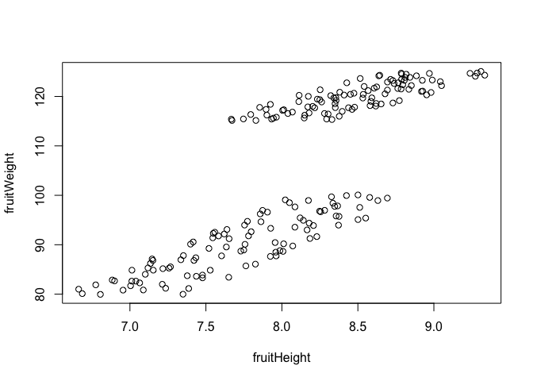
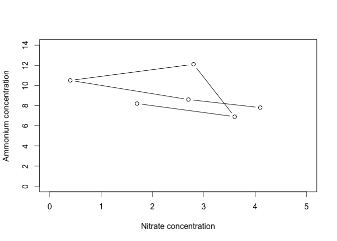
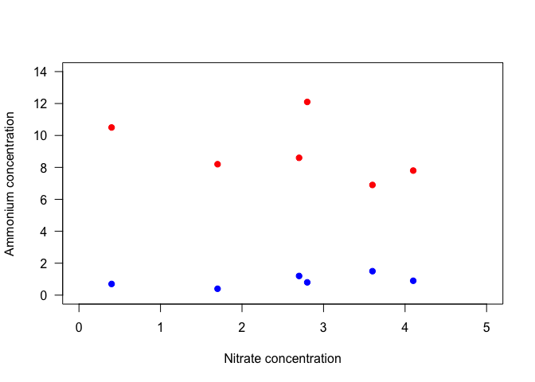
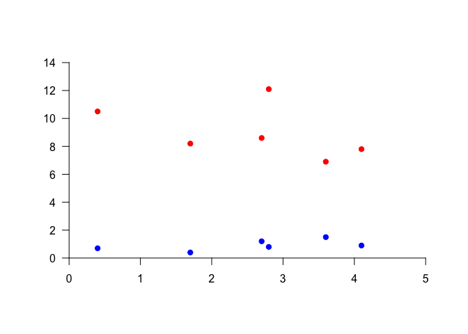

# Plotting with the base package
Lindsay Brin  
`r format(Sys.Date())`  

-----------

Also [this one](https://leemendelowitz.github.io/blog/r-base-graphics-plotting.html)
And [this one](http://rpubs.com/SusanEJohnston/7953)


```

## Why, and what?


The goal here is not to introduce you to every kind of plot available, but to give you experience making and formatting plots so that you are comfortable looking up details on any plot you might want to make in the future.  To this end, we will start by going into detail on formatting plots while working with a scatterplot, to give you a picture of how an R-generated plot could become a publication quality figure. We will then survey several other kinds of plots, using some of the formatting tools from the scatterplot section. We will conclude with some tips on outputting plots to pdf, which will help you make figures that you can sumbit to journals for publication.

The following pages may be helpful resources for making and formatting different kinds of plots:

* [Quick-R guide to basic graphs](http://www.statmethods.net/graphs/)
* [A Compendium of Clean Graphs in R](http://shinyapps.org/apps/RGraphCompendium/index.php)


## Scatterplots 

The [Data Carpentry R Ecology lesson on plotting](http://www.datacarpentry.org/R-ecology-lesson/05-visualization-ggplot2.html) has a nice introduction to cleaning data for plotting, and making a basic scatter plot, so we'll start there. We'll come back after the scatter plot, before "Plotting with ggplot2".

In the Data Carpentry lesson, hindfoot length and weight data from the surveys_complete data set were plotted as a scatterplot using the base graphics package.


```r
plot(x=surveys_complete$weight, y=surveys_complete$hindfoot_length)
```

The `x` and `y` arguments in this function call are quite long, and somewhat difficult to read quickly. If you were making many plots of variables within `surveys_complete`, you might want a cleaner way to specify the variables to be plotted. For a scatterplot, the data going into the plot can also be passed to the function by specifying the data set with the `data` argument, and then specifying the x and y variables as y plotted against x. This is the basic format:


```r
plot(y ~ x, data=surveys_complete)
```

To recreate the above plot exactly, we would use the following code:


```r
plot(hindfoot_length ~ weight, data=surveys_complete)
```



#### Challenge

* Using this syntax, where the data set is specified only once in the plot function, can make it simpler to plot subsets of data. Use what you learned about subsetting with dplyr to make a scatterplot of hindfoot length versus weight in which all data are from the year 1990.


## Plot structure and aesthetics

### `plot` and `par`
There are many options for modifying the structure and aesthetics of a plot. To start, we can modify options given in the `plot` function, which you can learn about through the help file using `?plot`.  

Let's work with the `nutrients` data frame from the earlier dplyr lessons. Try plotting ammonium concentration versus nitrate concentration; specify `type` to be both points and lines and label the x and y axes. 


```r
plot(Ammonium ~ Nitrate, data=nutrients, type="b", xlab="Nitrate concentration", ylab="Ammonium concentration")
```


Of course, lines don't make a lot of sense in this context, but it is helpful to know that this option exists!   

We can also specify the x and y axis limits, using `xlim` and `ylim`. Each of these arguments is a two-element vectors that specifies the beginning and end of the axes.


```r
plot(Ammonium ~ Nitrate, data=nutrients, type="b", xlim=c(0,5), ylim=c(0, 14), xlab="Nitrate concentration", ylab="Ammonium concentration")
```



We have many more options for modifying "parameters," which can be passed to the plot function. For a list of these, type `?par`. The help file will tell you that some parameters can only be set by a separate call to `par()`, whereas other, graphical parameters, can be passed to plot functions.  

Here are some of the more commonly used parameters:

* `col` - point/line **col**or
    + Color names, such as "red", as well as hexadecimal color codes   
* `pch` - **p**oint **ch**aracter, or symbol shape
    + A number from 1-25, or a vector of numbers with length equal to the plotted vectors
* `bg` - **b**ack**g**round color of the symbol, if applicable (pch between 21 and 25)
* `cex` - **c**haracter **ex**pansion, or point size
    + A number between 0 and 1, where 1 is full size
* `lty` - **l**ine **ty**pe
    + A number from 0 to 6, which specify options like solid, dotted, or dashed
* `lwd` - **l**ine **w**i**d**th
    + A positive number, where 1 is the default
* `las` - rotation of axis labels
    + A number from 0 to 3; 1 keeps all labels horizontal

There are 25 different symbols that can be specified by `pch`. You can look at all of them by making a simple plot - and let's plot the points in red, with a gray background, to demonstrate how `col` and `bg` are used.  


```r
plot(1:25, 1:25, pch=1:25, col="red", bg="gray")
```


You can see that for `pch` = 21 through 25, `bg` specifies the fill color of the point.

#### Challenge
* Using the nutrient data, make a plot of ammonium versus nitrate data that specifies all of the above parameters.

### Building up plots

You may have noticed that every time we use the `plot` function, a new plot is drawn. This is known as a "high level" plotting function. There are other, "lower level", plotting functions that can add additional things to the plot, such as lines, points, legends, axes, or text. Defining the plot space and then adding layers to the plot will allow you to have finer-grained control over the contents and aesthetics of your plot.   

For example, if we wanted to add the nitrite data to the plot of ammonium versus nitrate concentration above, we could use the `points` function. To visually separate the sets of data, we will define separate colors for each. We'll also go back to the default of using only points, and specify `pch` = 19, a solid point.


```r
plot(Ammonium ~ Nitrate, data=nutrients, pch=19, col="red", xlim=c(0,5), ylim=c(0, 14), xlab="Nitrate concentration", ylab="Ammonium concentration")
points(Nitrite ~ Nitrate, data=nutrients, pch=19, col="blue")
```


Notice that with the second set of points, the y-axis label no longer makes sense. We could specify the axis label in the initial plot command, but we have more control if we add it separately. It would also be nice to adjust the placement of the x and y axes.  So let's take another approach.  

We will start by plotting a blank plot that sets the plot bounds. We will do this by plotting points well beyond the range of the plot limits, specifying blank axis labels, and using the `axes` argument to keep the axes from being plotted. We will then add axes, using the `axis` function, and then points.   


```r
plot(100, 100, xlim=c(0,5), ylim=c(0, 14), xlab="", ylab="", axes=FALSE)  # Make empty plot
  axis(1, pos=0, las=1)  # Add x-axis
  axis(2, pos=0, las=1)  # Add y-axis
  points(Ammonium ~ Nitrate, data=nutrients, pch=19, col="red")  # Add ammonium points
  points(Nitrite ~ Nitrate, data=nutrients, pch=19, col="blue")  # Add nitrite points
```


[EXPLAIN AXIS FUNCTION] - point out that you can do axis 4 for a right-side axis (EXPLAIN 1-4 for sides)

We can then add axis labels using `mtext`. In particular, if we use the function `expression` rather than just a character string, we can incorporate text formatting like subscripts, superscripts, and greek letters. EXPLAIN THIS.


```r
plot(100, 100, xlim=c(0,5), ylim=c(0, 14), xlab="", ylab="", axes=FALSE)  
  axis(1, pos=0, las=1)
    mtext(text=expression("Nitrate concentration ("*mu*"mol L"^"-1"*")"), side=1, line=2)  # Add x-axis label
  axis(2, pos=0, las=1)  
    mtext(text=expression("Concentration ("*mu*"mol L"^"-1"*")"), side=2, line=2)  # Add y-axis label
  points(Ammonium ~ Nitrate, data=nutrients, pch=19, col="red")
  points(Nitrite ~ Nitrate, data=nutrients, pch=19, col="blue")
```



Now we need a legend. ADD TO THIS.


```r
plot(100, 100, xlim=c(0,5), ylim=c(0, 14), xlab="", ylab="", axes=FALSE)  # Make empty plot
  axis(1, pos=0, las=1)
    mtext(text=expression("Nitrate concentration ("*mu*"mol L"^"-1"*")"), side=1, line=2) 
  axis(2, pos=0, las=1) 
    mtext(text=expression("Concentration ("*mu*"mol L"^"-1"*")"), side=2, line=2) 
  points(Ammonium ~ Nitrate, data=nutrients, pch=19, col="red")  
  points(Nitrite ~ Nitrate, data=nutrients, pch=19, col="blue")  
  legend(x=0.1, y=14, legend=c("Ammonium", "Nitrate"), pch=19, col=c("red","blue"))  # Add a legend
```



...notice that the legend function is "dumb" (not automatic - more control, but have to be careful)...also see `?legend` for details on text size, removing the border, etc.

#### Challenge

Something with plot formatting?
___
___

Goals:

    + Legends

* Learn how to add text to plots (`text`)
* Learn how to use time-formatted axes
* Learn how to add lines to the plot: `abline`, plus a very brief nod to lines fit to data (linear regression, and polynomial maybe?), which will be expanded upon in the statistics lesson
* Learn several plot types
    + Scatter plots
    + Line plots
    + Bar plots
    + Histograms
* Learn how to output to a formatted pdf file


While it is easy to see the shape of the data in this plot, the plot itself does not look very nice. Let's work on making a cleaner looking plot that will not distract from the data.  Some tips to keep in mind:

* Keep it simple.  This means that white space is your friend.


_Some material taken from Clark Richard's CMOS 2016 workshop_


