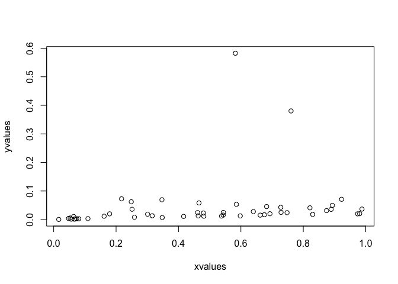

# Plotting with the base package


___

* [What, and why?](#motivation)   
* [Scatterplots](#scatterplots) 
	+ *[Challenge](#challengeScatter)*
	+ [Plot structure and aesthetics](#aesthetics)
	+ [`plot` and `par`](#plotPar)
		- *[Challenge](#challengeAes)*
	+ [Building up plots](#buildUp)
		- *[Challenge](#challengeBuildUp)*
	+ [Plotting text](#plotText)
* [Bar plots](#barPlots)
* [Outputting plots](#outputPlots)
* [The next step: ggplot2](#ggplot2)
* [Resources](#resources)  


___


# Why, and what? {#motivation}

Data is most useful when it can be communicated to others - and a picture is worth a thousand words! Being able to make clean, clear plots is essential to scientific communication. Being able to do so within R gives you some advantages, including being able to automate creation of multiple similar plots, and to very easily recreate a plot when your data change. Furthermore, if you can create plots quickly and easily, you have access to powerful tools for exploring your data.   

There are multiple options for approaches to creating plots in R, including using packages such as `ggplot2`, `ggvis`, and `lattice`, which extend the capabilities of the base plotting functions. However, it is still incredibly useful to understand how to work with the base graphics plotting functions, and even more so if you are using packages that rely on these functions. So, we will start with plotting in the base graphics package, and then introduce you to `ggplot2`.   

The goal of this lesson is to give you experience making and formatting plots so that you are comfortable looking up details on any plot you might want to make in the future.  To this end, we will start by going into detail on formatting plots while working with a scatterplot, to give you a picture of how an R-generated plot could become a publication quality figure. We will then use barplots to demonstrate how you can use some of the formatting tools from the scatterplot section on other kinds of plots. We will conclude with some tips on outputting plots to pdf, which will help you make figures that you can sumbit to journals for publication.   


# Scatterplots {#scatterplots}

Scatterplots can be made with the function `plot`, and only require x and y vectors to be plotted against each other. As an example, let's create two vectors and plot them against each other.


```r
# Create a vector of 50 random numbers
	xvalues <- runif(50)
# Create a vector of 50 lower numbers 
	yvalues <- xvalues/c(1:50)

# Plot these vectors against each other
	plot(xvalues, yvalues)
```



We can also plot variables that are contained within a data frame.  Let's read in a data file of fake fruit heights and weights.


```r
# Read in data
	fruitData <- read.csv(file="Data/fruitData.csv")

# Take a look at the data frame structure
	str(fruitData) 
```


```
## 'data.frame':	200 obs. of  3 variables:
##  $ fruitHeight: num  7.07 7.05 6.93 6.98 7.36 ...
##  $ fruitWeight: num  80 80.3 80.1 80.7 81.2 ...
##  $ fruitType  : Factor w/ 2 levels "Apple","Pear": 1 1 1 1 1 1 1 1 1 1 ...
```

It looks like we have height and weight data for both apples and pears. Let's plot weight against height. We can do this by specifying our vectors as variables within the data frame, i.e. by using `$`.


```r
# Plot fruit height and weight
	plot(fruitData$fruitHeight, fruitData$fruitWeight)
```


The `x` and `y` arguments in this function call are quite long, and somewhat difficult to read quickly. If you were making many plots of variables within `fruitData`, you might want a cleaner way to specify the variables to be plotted. 

To do this, we can pass data to the `plot` function by specifying the data set with the `data` argument, and then specifying the x and y variables with only the variable names. This is the basic format (where `x`, `y`, and `yourDataFrame` would be substituted with the names of your x variable, y variable, and data frame respectively):


```r
plot(y ~ x, data=yourDataFrame)
```

Note that the order of the variables is switched from `x, y` to `y ~ x`! This command can be thought of as "plot y against x." To recreate the above plot exactly, we would use the following code:


```r
plot(fruitWeight ~ fruitHeight, data=fruitData)
```


#### Challenge {#challengeScatter}

1. Using the `metals` data frame from the lesson on joins, plot Pb concentrations against Cu concentrations. Then plot Pb concentrations against Fe concentrations.


2. The syntax where the data set is specified only once in the plot function can make it simpler to plot subsets of data. Using what you learned about subsetting with `dplyr`, make a scatterplot of fruit weight versus fruit height using only data on pears, i.e., by specifying the appropriate data set in the `data` argument of the plot function.


## Plot structure and aesthetics {#aesthetics}

## `plot` and `par` {#plotPar}
There are many options for modifying the structure and aesthetics of a plot. To start, we can modify options given in the `plot` function, which you can learn about through the help file using `?plot`.  

Let's work with the `nutrients` data frame from the earlier dplyr lessons. Try plotting ammonium concentration versus nitrate concentration, and look at the help file to specify `type` to be both points and lines and to label the x and y axes. 


```r
plot(Ammonium ~ Nitrate, data=nutrients, type="b"
		 , xlab="Nitrate concentration", ylab="Ammonium concentration")
```


Of course, lines don't make a lot of sense in this context, but it is helpful to know that this option exists!   

R picks axis limits based on the values being plotted. The default is to increase the range by 4% and then pick axis limits. However, we usually want to have axes start at 0, and end at a nice round number. To do this, we can specify the x and y axis limits, using the arguments `xlim` and `ylim`. Each of these arguments requires a two-element vectors that specifies the beginning and end of the axes.


```r
plot(Ammonium ~ Nitrate, data=nutrients, type="b", xlim=c(0,5), ylim=c(0, 14)
		 , xlab="Nitrate concentration", ylab="Ammonium concentration")
```


This is already starting to look a bit better!   

We have many more options for modifying "parameters," which can be passed to the plot function. For a list of these, type `?par`. The help file will tell you that some parameters can only be set by a separate call to `par()`, including parameters that have to do with layout and spacing of the plots. We will look at some of these later. Other, graphical parameters, can be passed to plot functions, and these are the ones we will look at now.  

Here are some of the more commonly used parameters:

* `col` - point/line **col**or
    + Color names, such as "red", as well as hexadecimal color codes   
* `pch` - **p**oint **ch**aracter, or symbol shape
    + A number from 1-25, or a vector of numbers from 1-25 with length equal to the plotted vectors
* `bg` - **b**ack**g**round color of the symbol, if applicable (pch between 21 and 25)
* `cex` - **c**haracter **ex**pansion, or point size
    + Magnification relative to the default (1); can be greater or lesser than 1
* `lty` - **l**ine **ty**pe
    + A number from 0 to 6, which specify options like solid, dotted, or dashed
* `lwd` - **l**ine **w**i**d**th
    + A positive number, where 1 is the default
* `las` - rotation of tick labels
    + A number from 0 to 3; 1 keeps all labels horizontal

There are 25 different symbols that can be specified by `pch`. You can quickly look at all of them by making a plot of 25 points with pch equal to 1:25, as below.  Let's also plot the points in red, with a gray background, to demonstrate how `col` and `bg` are used to specify symbol colors.  


```r
plot(1:25, 1:25, pch=1:25, col="red", bg="gray")
```


You can see that `col` specifies point color, but sometimes this refers to the outline of an open symbol. For `pch` = 21 through 25, `bg` specifies the fill color of the point.

#### Challenge {#challengeAes}
3. Using the nutrient data, make a plot of ammonium versus nitrate data that specifies all of the above parameters. Try a few different values for each.

## Building up plots {#buildUp}

You may have noticed that every time we use the `plot` function, a new plot is drawn. This is known as a "high level" plotting function. There are other, "lower level", plotting functions that can add additional things to the plot, such as lines, points, legends, axes, or text. Defining the plot space and then adding layers to the plot will allow you to have finer-grained control over the contents and aesthetics of your plot.   

For example, if we wanted to add the nitrite data to the plot of ammonium versus nitrate concentration above, we could use the `points` function. To visually separate the sets of data, we will define separate colors for each. We'll also go back to the default of using only points, and specify `pch = 19`, a solid point, and `las = 1` for horizontal tick labels.


```r
plot(Ammonium ~ Nitrate, data=nutrients, pch=19, col="red", xlim=c(0,5), ylim=c(0, 14)
		 , xlab="Nitrate concentration", ylab="Ammonium concentration", las=1)
points(Nitrite ~ Nitrate, data=nutrients, pch=19, col="blue")
```


Notice that with the second set of points, the y-axis label no longer makes sense. We could specify the axis label in the initial plot command, but we have more control if we add it separately. It would also be nice to adjust the placement of the x and y axes.  So let's take another approach, and plot different components of the plot separately from each other.  

We will start by plotting a blank plot that sets the plot bounds. We will do this by setting `type`="n" to keep points from being plotted, setting `axes` to FALSE to keep the axes from being plotted, and specifying `ann` (annotations) as FALSE to suppress axis labels. We will then add axes with the `axis` function, and then points with `points`. Try this yourself, and run one line at a time.   


```r
plot(1, 1, xlim=c(0,5), ylim=c(0, 14), type="n", ann=FALSE, axes=FALSE)  # Make empty plot
  axis(side=1, pos=0, las=1)  # Add x-axis
  axis(side=2, pos=0, las=1)  # Add y-axis
  points(Ammonium ~ Nitrate, data=nutrients, pch=19, col="red")  # Add ammonium points
  points(Nitrite ~ Nitrate, data=nutrients, pch=19, col="blue")  # Add nitrite points
```


The `axis` function has many optional parameters. The help file (`?axis`) gives you a list, and also notes that other graphical `par`ameters can be passed to this function. The one required argument is `side`. Plot sides are represented by a number from 1 to 4, where 1 is the bottom, and the numbering goes clockwise around the plot (i.e., the left side is 2). This makes it straightforward to add a separate axis on the right side, i.e. by specifying `side=4`.   

`Line` tells the function how far away from the axis to put the text. Line numbers start at the axis and move outward. Line numbers do not need to be whole numbers, and using decimals allows for some fine-tuned spacing.

Another helpful argument is `pos` (position), which allows you to control where the axis is in terms of its intersection with the perpendicular axis. Try adding another y-axis at x=2 to understand how this works.   

Last, as above, `las` specifies the rotation of the tick labels, where 1 means parallel to the reading direction.

Now that we have our plot, we can add axis labels using `mtext`. In particular, if we use the function `expression` rather than just a character string, we can incorporate text formatting like subscripts, superscripts, and greek letters. `expression` takes a vector of objects, such as strings (in quotes), or variables denoting Greek letters, and other symbols that determine how the components are connected. For example, you can use * for simple concatenation, ^ for a superscript, or enclose the text with [ ] for a subscript. 


```r
plot(100, 100, xlim=c(0,5), ylim=c(0, 14), xlab="", ylab="", axes=FALSE)  
  axis(1, pos=0, las=1)
    mtext(text=expression("Nitrate concentration ("*mu*"mol L"^"-1"*")"), side=1
    			, line=2)  # Label x-axis
  axis(2, pos=0, las=1)  
    mtext(text=expression("Concentration ("*mu*"mol L"^"-1"*")"), side=2
    			, line=2)  # Label y-axis
  points(Ammonium ~ Nitrate, data=nutrients, pch=19, col="red")
  points(Nitrite ~ Nitrate, data=nutrients, pch=19, col="blue")
```


Now let's add a legend. You can do this with the `legend` function. Important arguments to the `legend` function include those that specify its position, the legend text, the line size or point type, and the symbol colors. For the position, you can specify `x` and `y` with values, or you can give descriptive strings to `x`: "topright", "topleft", "bottomright", "bottomleft", and "center". We'll specify the position with coordinates.

Also, note that `pch` can be given as a single integer, which will be applied to all points, or as a vector specifying the symbol for each point in the legend.   


```r
plot(100, 100, xlim=c(0,5), ylim=c(0, 14), xlab="", ylab="", axes=FALSE)  # Make empty plot
  axis(1, pos=0, las=1)
    mtext(text=expression("Nitrate concentration ("*mu*"mol L"^"-1"*")"), side=1, line=2) 
  axis(2, pos=0, las=1) 
    mtext(text=expression("Concentration ("*mu*"mol L"^"-1"*")"), side=2, line=2) 
  points(Ammonium ~ Nitrate, data=nutrients, pch=19, col="red")    
  points(Nitrite ~ Nitrate, data=nutrients, pch=19, col="blue")  
  legend(x=0.1, y=14, legend=c("Ammonium", "Nitrate"), pch=19, col=c("red","blue"))  # Add legend
```


Notice that the legend is not connected to the contents of the plot. This means that you have to carefully check that you've specified the colors, lines, etc. correctly, to avoid displaying the wrong information. However, it also means that you have more control on the legend contents and formatting.   

Take a look at `?legend` for details on things like specifying text size and line spacing, removing the border or background, etc.  


#### Challenge {#challengeBuildUp}

4. Make a plot that is similar to the one above, but plot different symbols for different values of `Treatment`.


## Plotting text {#plotText}

Sometimes it is useful to add text to a plot, e.g. to add panel letters or equations, or to add lowercase letters that specify statistical differences. You can use the function `text` to do this.   

`text` is very similar to `points`. It requires arguments that specify the location (`x` and `y`) of the text and the `label`s, or the text itself, and these vectors must all be the same length. `text` can also take arguments specifying other optional `par`ameters. Just for fun, let's try plotting the data as numbers corresponding to the sample replicates, instead of points.   


```r
plot(100, 100, xlim=c(0,5), ylim=c(0, 14), xlab="", ylab="", axes=FALSE)
  axis(1, pos=0, las=1)
    mtext(text=expression("Nitrate concentration ("*mu*"mol L"^"-1"*")"), side=1, line=2) 
  axis(2, pos=0, las=1) 
    mtext(text=expression("Concentration ("*mu*"mol L"^"-1"*")"), side=2, line=2) 
  text(Ammonium ~ Nitrate, data=nutrients, labels=Replicate, col="red")  # Add text instead of points
  text(Nitrite ~ Nitrate, data=nutrients, labels=Replicate, col="blue")  # Add text instead of points 
  legend(x=0.1, y=14, legend=c("Ammonium", "Nitrate"), pch=21, col=c("red","blue")) 
```


We can conclude from this plot that if you try to make up random numbers for concentrations, you may still end up following a subconscious pattern!


# Bar plots {#barPlots}

Let's try plotting a bar plot showing mean concentrations of each nutrient. First, we need to summarize the data to find the values to plots.


```r
nutrients_mean <- nutrients %>% 
  group_by(Treatment) %>% 
  summarize(Ammonium=mean(Ammonium), Nitrate=mean(Nitrate), Nitrite=mean(Nitrite))
nutrients_mean
```

```
## # A tibble: 2 × 4
##   Treatment Ammonium Nitrate   Nitrite
##       <int>    <dbl>   <dbl>     <dbl>
## 1         1 9.066667     2.7 0.9000000
## 2         2 8.966667     2.4 0.9333333
```

Now that we have a table that gives us the mean value for each nutrient for each concentration, we can plot these values. The function `barplot` require matrices as input, and will plot all values in the matrix. We can use `select` to choose only the variables we want to plot, and `as.matrix` to convert to a matrix, and we can do this within the argument to the barplot function to avoid creating a separate, intermediate data frame.

When we call the function `barplot`, it will plot each variable (column) separately, and group observations (rows) within each variable. The default is to make a stacked bar plot, with each bar made of the rows within a variable.

As with scatterplots, we can include an axis label and specify parameters, such as `las=1`.   


```r
barplot(nutrients_mean %>%
          select(Ammonium, Nitrate, Nitrite) %>%
          as.matrix() 
				, las=1, ylab="Concentration")
```


We probably don't want a stacked bar plot here - it would make more sense to have the bars next to each other. To do that, we can specify `beside=TRUE`. To help with spacing, we will also specify the space between each set of bars, using `space`. For multiple bars in each group, `space` is a vector with two values, where the first value is the space between bars within the group, and the secong value is the space between groups, both as a fraction of the bar width. We'll separate the bars within the groups just a little bit.   

We can also set the y-axis limits as with a scatterplot, make the tick labels parallel to the reading direction.   


```r
barplot(nutrients_mean %>%
          select(Ammonium, Nitrate, Nitrite) %>%
          as.matrix() 
        , beside=TRUE, space=c(0.1,1), ylim=c(0,10), las=1, ylab="Concentration")
```


And last, as with scatterplots, we can add a legend to differentiate between treatments. Remember that you have to specify the colors in a legend, so it's important to be sure that you get this right!


```r
barplot(nutrients_mean %>%
          select(Ammonium, Nitrate, Nitrite) %>%
          as.matrix() 
        , beside=TRUE, space=c(0.1,1), ylim=c(0,10), las=1, ylab="Concentration")
legend("topright", pch=22, col="black", pt.bg=gray.colors(2), legend=c("Treatment 1", "Treatment 2"))
```


# Outputting plots {#outputPlots}

When we plot in R, the plot is drawn in a separate window, or graphics device. In RStudio, unless we specify otherwise, this graphics device is the Plots window.  You can export a plot in a variety of different formats, but this can become inconvenient as you make changes to your plot, and the relative dimensions of the plot may change depending on the size of your window or the exported file.   

A more direct way to create an external figure is to open a file of the type that you prefer (pdf, png, etc.), and plot to it directly.  Technically, this means that you are opening a separate graphics device, plotting to it, and then closing it.  One benefit of this approach is that you can specify the dimensions of this file, as well as its layout, margins, and other characteristics, and know that they will be consistent every time.   

The way to open a file differs between a Mac and a PC. On a Mac, you can use the `quartz` function for all kinds of files, as long as you specify the file `type`. On a PC, you need use different functions for different file types; for a pdf, you can use `pdf`. (This function works on a Mac as well.) In either case, you will need to specify the name of the file with `file`, as well as its dimensions. You can also specify other characteristics, such as the font `pointsize`. 

Creating an 8.5 x 11 file will be helpful for visualizing the plot on a standard sheet of paper. Even if you don't intend to print the plot, however, it is still useful to be able to specify dimensions, because (1) the relative dimensions of the plot and its contents (text size, point size, line width) will be the same time every time you plot it, and (2) you can more easily maintain a consistent design across multiple plots.  

For example, to open a pdf file, you can run one of the following functions:


```r
# Use ONE of the following functions to open a new graphics device
# (and only run it once, to avoid opening multiple files!).

# On a Mac, use quartz() for many file types, and specify with type.
	quartz(type="pdf", file="Figures/Fruits.pdf", height=11, width=8.5, pointsize=14)

# On a PC, use pdf() to open a pdf file.
# This function also works on a Mac.
	pdf(file="Figures/Fruits.pdf", height=11, width=8.5, pointsize=14)
	
# In either case, be sure the file name is appropriate for your own file structure!
```

Once you've opened your file, anything you plot will go to this file rather than to the plot window in RStudio. 

In this case, we'd like to put two different plots on the pdf page, so we need to tell R how to place the plots.  This involves two components: the placement of the plots in a grid, and the margins around each plot.  We can do both of these, as well as determine the margins for the overall document, with a call to `par()`. 

Within the function `par()`, we can specify the margins around each plot with the argument `mar` ("margins") and for the entire document with the argument `omi` ("outer margin in inches"). Both of these require a vector with four integers, specifying margins on all sides, starting at the bottom and going clockwise. If you want to plot multiple plots, you can also specify the number of rows and columns with `mfrow`, which takes a vector with two integers, of the form c(#rows, #cols) (i.e., number of rows and then number of columns). (If you only want to plot one plot, you can skip the `mfrow` argument.) For example:   


```r
par(omi=c(2,1,1,1), mar=c(7,5,2,2), mfrow=c(2, 1))
```

This sets R up to create a document with plots in 2 rows and 1 columns (`mfrow`). The margin for the whole page (`omi`) is a bit bigger on the bottom than the other sides, and the margin for each figure (`mar`) is larger on the bottom and the left, to make room for the axes and axis labels.  Note that `par()` with `mfrow`, `mar`, and `omi` can be used within the RStudio graphics device as well, to put multiple plots on the same page layout.

After you have opened your device and set up your margins and plot layout, it's time to make your plots, i.e. with `plot()` or other plotting functions.


```r
plot(fruitWeight ~ fruitHeight, data = fruitData %>% filter(fruitType == "Pear"), las = 1, pch = 19, col = "lightgreen")
	mtext(text = "Pears", side = 3, line = 1)
plot(fruitWeight ~ fruitHeight, data = fruitData %>% filter(fruitType == "Apple"), las = 1, pch = 19, col = "darkred")
	mtext(text = "Apples", side = 3, line = 1)
```

Once you are done, you need to close the plotting device using `dev.off()`. 


```r
dev.off()
```

Then, voila! Your plot is in pdf form.  The above code will produce something like this:


(The above image is in .png form to sidestep issues with some browsers not rendering pdfs properly.)

Below is an example of code for the entire process (opening the device, drawing the plots, and closing the device), to make a plot called `Nutrients.pdf` that has two side by side plots (1 row with 2 columns) showing `Ammonium` or `Nitrite` concentrations versus `Nitrate` concentrations.


```r
# Make a pdf file with two plot panels: 
#  Ammonium vs. nitrate
#  Nitrite vs. nitrate

pdf(file="Figures/Nutrients.pdf", height=11, width=8.5, pointsize=12)

  # Specify outer margins, plot margins, and plot layout
	# Note that the omi argument specified here gives a very large bottom margin,
	#  since we want our two plots at the top of the page.
    par(omi=c(7,0.5,1,1), mar=c(5,5,0,0), mfrow=c(1,2))

  # Make ammonium plot
  # It doesn't matter what values we plot in the plot() function, 
  #		since type is set to "n" (no plotting), and the points are added with points().
    plot(100, 100, xlim=c(0,5), ylim=c(0, 14), xlab="", ylab="", axes=FALSE, type = "n")
      axis(1, pos=0, las=1)
        mtext(text=expression("Nitrate concentration ("*mu*"mol L"^"-1"*")"), side=1, line=2) 
      axis(2, pos=0, las=1) 
        mtext(text=expression("Ammonium concentration ("*mu*"mol L"^"-1"*")"), side=2, line=2) 
      points(Ammonium ~ Nitrate, data=nutrients, pch=19, col="red")

  # Make nitrite plot
    plot(100, 100, xlim=c(0,5), ylim=c(0, 14), xlab="", ylab="", axes=FALSE, type = "n")
      axis(1, pos=0, las=1)
        mtext(text=expression("Nitrate concentration ("*mu*"mol L"^"-1"*")"), side=1, line=2) 
      axis(2, pos=0, las=1) 
        mtext(text=expression("Nitrite concentration ("*mu*"mol L"^"-1"*")"), side=2, line=2) 
      points(Nitrite ~ Nitrate, data=nutrients, pch=19, col="blue")

dev.off()
```


<br>


<br>

(The above image is in .png form to sidestep issues with some browsers not rendering pdfs properly.)

You can run into problems when plotting to external graphics devices if you accidentally open more devices than you intend, or forget to close your devices. If you find that later plots are not being plotted properly, either within RStudio or to an external file, this may be because you have plotting devices open that you aren't aware of.  You can check which devices are open with `dev.list()`, and check which device is the current device (i.e., where your plots are being plotted) with `dev.cur()`.  You can close specific devices using `dev.off()` with the argument `which` indicating the number of the graphics device that you want to close.  I.e., if you want to close device 3, you can run `dev.off(which = 3)` or `dev.off(3)`.


___

# The next step: ggplot2 {#ggplot2}

`ggplot2` is a package that contains functions that can simplify plotting, even for relatively advanced, complex, or multi-layered plots.  Although we are not covering it in this course, it is a very good tool to learn.  

There are many online resources for learning this package, including a highly recommended [Data Carpentry lesson on using ggplot2](http://www.datacarpentry.org/R-ecology-lesson/05-visualization-ggplot2.html); take a look at that lesson to get a sense of what `ggplot2` can do. 

More info on `ggplot2` can be found on the [official website](http://ggplot2.org).

___

# Resources {#resources}

The following pages may be helpful resources for making and formatting different kinds of plots:

* [Quick-R guide to basic graphs](http://www.statmethods.net/graphs/)
* [A Compendium of Clean Graphs in R](http://shinyapps.org/apps/RGraphCompendium/index.php)
* [RStudio: R Base Graphics: An Idiot's Guide](http://rpubs.com/SusanEJohnston/7953)

<br>
<hr>
<br>


